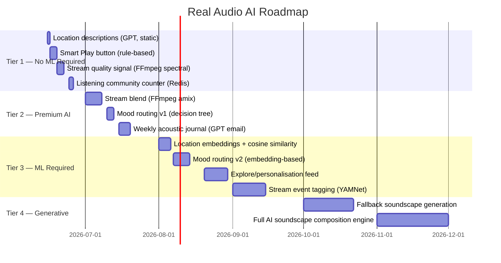

# Real Audio — AI Features Roadmap

> Role: Product Manager + AI Architect
> Foundation: Real, live ambient audio → AI enhances without replacing authenticity

---

## Core AI Philosophy

Every AI feature in Real Audio must obey one rule:

> **AI amplifies the realness. It never replaces it.**

The product's moat is authenticity. AI should help users find the right live sound faster, blend real sounds more intelligently, and surface insights from their listening — not generate fake soundscapes to fill gaps.

**AI = navigator, not composer.**

---

## AI Features Roadmap

### Tier 1 — Quick AI wins (1–2 weeks each, high ROI, low complexity)

---

#### AI-1: Smart "Play Something" Button

**What:** A single button that picks the best stream for the current moment. No configuration required.

**How it works:**
```
Input signals:
  - Time of day (local time of user)
  - Day of week
  - User's listening history (if authenticated)
  - Current weather at user's location (optional, via Open-Meteo API — free)
  - Time since last session

Decision logic (rule-based v1, ML v2):
  - 6am–9am + weekday → energetic nature (birdsong, water)
  - 9am–5pm + weekday → steady nature or urban (focus streams)
  - 5pm–8pm → transition (city evening, coastal)
  - 9pm–midnight → quiet nature (forest, glacier)
  - After midnight → silence-adjacent (glacier, Scottish loch)
  - Raining in user's city → water sounds (Knepp water, Marseille sea)
  - User has never heard Kenya → suggest Kenya
```

**Implementation:**
```typescript
// app/api/recommend/route.ts
export async function GET(request: NextRequest) {
  const hour = parseInt(request.nextUrl.searchParams.get('hour') ?? '12')
  const history = request.nextUrl.searchParams.get('history') ?? '' // comma-separated IDs
  const weather = request.nextUrl.searchParams.get('weather') ?? 'clear'

  const played = new Set(history.split(','))
  const unplayed = LOCATIONS.filter(l => !played.has(l.id))
  const candidates = unplayed.length > 0 ? unplayed : LOCATIONS

  // Rule-based scoring
  const scored = candidates.map(loc => {
    let score = 0
    if (hour >= 22 || hour < 6) score += loc.category === 'nature' ? 3 : 0
    if (hour >= 9 && hour < 17) score += 1 // any stream during work hours
    if (weather === 'rain') score += loc.description.includes('stream') || loc.description.includes('sea') ? 2 : 0
    score += Math.random() * 0.5 // small randomness to prevent repetition
    return { loc, score }
  })

  const best = scored.sort((a, b) => b.score - a.score)[0].loc
  return Response.json({ id: best.id, label: best.label, reason: '...' })
}
```

**UX:** A small ✦ button beside the play button. On tap: "Playing something right for this moment. → [Location name]" (subtle text, not a modal).

**Revenue link:** Free for all users in v1. v2 (ML-powered personalisation) is a premium feature.

---

#### AI-2: Location Descriptions (GPT-generated, static)

**What:** Each of the 18 location rows expands to show a 2-sentence GPT-generated description of the real place — its geography, ecology, culture, what sounds you might hear.

**Current state:** Only a 3-word description exists (e.g., "Chalk stream & birdsong").

**Generated examples:**
- **Knepp Wildland, England:** *"A rewilded estate in West Sussex where chalk streams run between scrub oak and hawthorn. In spring the nightingales are loud enough to hear from miles away; in winter the only sound is water over flint."*
- **Dunga Swamp, Kenya:** *"A wetland at the edge of Lake Victoria near Kisumu, alive at night with fish eagles, hippo grunts, and the distant sound of fishing boats. The atmosphere shifts entirely between 3 AM and 6 AM."*
- **Gusan-dong, Seoul:** *"A dense residential neighbourhood in northwest Seoul, where apartment towers meet street markets. The soundscape cycles through quiet mornings, school rush, delivery motorcycles, and the distant Han river wind."*

**Implementation:** Pre-generated at build time with GPT-4o mini. Costs < $0.50 for all 18 descriptions. Store in JSON file alongside location data.

**UX:** Expand/collapse row on tap. Shows on hover for desktop.

---

#### AI-3: Stream Quality Signal (on-the-fly analysis)

**What:** Real-time spectral richness score — tells users whether the current stream is "active" (rich soundscape) or "quiet" (nearly silent, possibly offline or a calm time of day).

**How:** Server-side, every 5 minutes, the health endpoint (`/api/stream/health`) also runs a brief FFmpeg spectral analysis:
```bash
ffmpeg -i <url> -t 10 -af astats -f null - 2>&1 | grep "RMS level"
```

Map RMS level to a 1–5 "activity" score. Show as a subtle indicator (e.g., waveform icon with 1–5 bars, greyed = quiet, full = active).

**UX:** Tiny waveform icon with activity bars in each location row. Tooltip: "Very active right now" / "Quiet at this hour (local time 03:20)".

**Value:** Prevents users from playing a silent stream and thinking the app is broken. Massive trust signal.

---

### Tier 2 — Medium-complexity AI (2–4 weeks, premium features)

---

#### AI-4: Stream Blend (live crossfade — Real Audio's killer feature)

**What:** Mix two live streams simultaneously using FFmpeg's `amix` filter on the server. User controls the blend ratio with a slider (0% = stream A only, 100% = stream B only, 50% = equal blend).

**Why this is the moat:** No other ambient audio app — not Calm, not Brain.fm, not Endel — can do this with live audio. Blending "Knepp water" with "Gusan-dong Seoul" creates a sound that has never existed before and can never be recreated.

**Server implementation:**
```typescript
// Two FFmpeg processes → amix filter complex
const blend = ffmpeg()
  .input(STREAMS[idA].url)
  .input(STREAMS[idB].url)
  .inputOptions(['-reconnect 1', '-icy 0'])
  .complexFilter([
    `[0:a]volume=${1 - ratio}[a0]`,
    `[1:a]volume=${ratio}[a1]`,
    '[a0][a1]amix=inputs=2:duration=longest[aout]'
  ])
  .outputOptions(['-map [aout]', '-c:a libmp3lame', '-b:a 128k', '-f mp3'])
  .pipe(passThrough, { end: true })
```

**UX:**
1. User selects primary location (existing UI)
2. "Blend with..." button appears when playing
3. Tap: second location picker (same list, cannot pick same as primary)
4. Slider: [Scotland Forest ← 50% → Seoul Street]
5. Blend ratio adjustable in real time (requires new FFmpeg process on change)

**Premium feature.** Free users see the UI but cannot activate — "Explorer feature: blend two live worlds."

**Revenue story for investors:** Combinatorial explosion — 18 × 17 = 306 unique blends, each one a never-before-heard sound composition. Infinite replayability from 18 sources.

---

#### AI-5: Mood Detection & Auto-Routing

**What:** Optional questionnaire at start of session (3 taps) → AI routes to the ideal stream.

**Flow:**
```
"How are you feeling right now?"
→ [Focus] [Relax] [Drift] [Energise] [Unwind for sleep]

"What's your environment like?"
→ [At home] [At work] [Commuting] [Can't sleep]

→ "Playing Gair Wood, Scotland — ancient forest floor.
   This is quiet but present. Perfect for deep focus."
```

**Backend:** v1 = simple decision tree (hardcoded). v2 = embed user responses + time/weather into a vector space and find nearest neighbour from location embeddings.

**Location embeddings (pre-computed, stored as JSON):**
```json
{
  "knepp": { "energy": 0.4, "complexity": 0.6, "urban": 0.0, "water": 0.8, "silence": 0.2 },
  "ortler": { "energy": 0.1, "complexity": 0.1, "urban": 0.0, "water": 0.0, "silence": 0.95 },
  "seoul": { "energy": 0.8, "complexity": 0.9, "urban": 1.0, "water": 0.0, "silence": 0.0 }
}
```

User mood maps to a target vector → cosine similarity → best match.

**Premium feature.** Free users get 1 mood routing per day; Explorer gets unlimited + learns preferences.

---

#### AI-6: Weekly Acoustic Journal

**What:** Automated weekly email (or in-app card) summarising the user's listening week in atmospheric prose.

**Example output (GPT-4o mini, $0.002 per email):**
> *"This week you listened for 4 hours and 22 minutes. You started in France — the Sibra farm in the Ariège valley — and spent most of Monday morning there. On Wednesday night you discovered Kenya; you listened to Dunga Swamp for 47 minutes after midnight, which tells us something about that night. Your most played category was nature (89%). This week's unvisited recommendation: the Ortler Glacier in the Alps — wind, ice, and very little else."*

**Implementation:**
- Cron job (weekly, Sunday 8 PM user local time)
- Fetch user's week from DB (`listen_session` table)
- Build structured prompt from data
- Generate with GPT-4o mini
- Send via Resend (email API)

**Cost:** ~$0.002/user/week = $0.10/user/year. Trivial.

**Retention impact:** Expected +15–25% improvement in 4-week retention for users who receive it. This is the product's relationship-building mechanism.

**Premium feature** (free users get monthly summary only).

---

### Tier 3 — Advanced AI (3–6 months, significant engineering)

---

#### AI-7: Real-time Stream Transcription & Environment Tags

**What:** Continuously transcribe audio events (not speech) from each stream using a lightweight audio classifier (e.g., YAMNet or PANNs), and surface live tags.

**Example UI:**
```
Bergen (Loch Patrick, Scotland)
── Now: wind · reeds · occasional bird ──
```

**Implementation:**
- Server-side Python microservice (separate from Next.js)
- Every 30s: grab 10s audio clip from each of 18 streams
- Run YAMNet (open source, free) → top 3 event classes
- Cache results, serve via `/api/stream/tags?id=X`
- Update UI every 60s

**Why this is powerful:** It transforms the location list from a static menu into a live information feed. "Bergen has wind right now" is compelling to users choosing between locations.

**Infrastructure note:** YAMNet runs on CPU, ~100ms inference per 10s clip, ~18 clips/minute = very low cost even on a small instance.

---

#### AI-8: AI-Generated Soundscape Fallback

**What:** When a Locus Sonus stream goes offline (which happens), instead of showing "Stream error", generate an AI ambient soundscape that matches the sonic character of the offline location.

**Technology:** Meta's AudioCraft / MusicGen (open source) or ElevenLabs Audio (API).

**Prompt pattern:**
```python
def generate_fallback(location_id: str) -> bytes:
    profiles = {
        "knepp": "gentle chalk stream with wood pigeons and distant birdsong, English countryside, spring morning",
        "ortler": "high altitude mountain wind, thin air, ice cracking, no birds, vast silence",
        "seoul": "busy Korean residential street, motorcycles, voices, city ambience"
    }
    # → MusicGen API call → 30s audio clip → cache → loop on client
```

**UX:** Subtle indicator "⚡ Generated ambient (live mic temporarily offline)"

**Value:** Turns a failure mode into a graceful degradation. Users don't lose their session when a volunteer's Raspberry Pi reboots.

---

#### AI-9: Personalised "Explore" Feed

**What:** For authenticated users, a personalised "you haven't heard this yet" discovery section, ordered by predicted enjoyment based on listening history.

**Implementation:**
- Collaborative filtering: "Users who listen to Knepp and Scotland also love Gair Wood"
- Content-based filtering: "You prefer nature + water + low energy → try Kisumu swamp"
- Matrix factorisation (SVD) on user×location listening matrix
- Served via `/api/recommend/explore?userId=X`

**Required:** Listening history data from ~500+ users before this becomes meaningful.

---

#### AI-10: Live Listening Community Layer

**What:** Real-time counter: "14 people are listening to Provence right now."

For premium users: optional presence — see a subtle "and 3 people you might know" (based on opt-in social graph or mutual invites).

**Why this matters:** Social proof + ambient community. Knowing 14 strangers are silently sharing a soundscape makes it feel like a place, not just a stream.

**Implementation:** Redis counter per stream ID, incremented on play, decremented on stop/disconnect. Served via Server-Sent Events or simple polling.

---

## AI Cost Projections

| Feature | Tech | Cost per user/month | At 10K users |
|---------|------|--------------------|-----------| 
| Smart Play button | Rule-based (v1), free | $0 | $0 |
| Location descriptions | GPT-4o mini, one-time | $0 (pre-generated) | $0 |
| Stream quality signal | FFmpeg spectral, free | $0 | $0 |
| Stream blend | FFmpeg amix, compute | $0.50 infra | $5,000 |
| Mood routing (v1) | Decision tree, free | $0 | $0 |
| Mood routing (v2) | Embeddings, ~$0.001/query | $0.05 | $500 |
| Weekly acoustic journal | GPT-4o mini, $0.002/email | $0.002/week | $200 |
| Stream tags (YAMNet) | OSS, compute | $0.10 infra/stream | $1,800 |
| Fallback soundscape | MusicGen/ElevenLabs | $0.05/generation | Variable |
| Explore feed | Collaborative filtering | $0 (query time) | $0 |

**Total AI cost at 10K users: ~$7,500/month**
At $4.99/month premium × 600 subscribers (6% of 10K) = $2,994 MRR.

AI infrastructure at this scale is subsidised by free tier growth (more users → more data → better model → better conversion → more revenue). The crossover point is around 20K MAU.

---

## AI Features by Tier

| Feature | Free | Premium | Required data | Complexity |
|---------|------|---------|--------------|-----------|
| Smart Play (rule-based) | ✅ | — | None | Low |
| Location descriptions | ✅ | — | None (pre-generated) | Low |
| Stream quality signal | ✅ | — | None | Low |
| Mood routing v1 | ✅ 1/day | ✅ Unlimited | None | Low |
| Listening community counter | ✅ | — | None | Low |
| Weekly journal (monthly) | ✅ | — | Auth + history | Medium |
| Weekly journal (weekly) | — | ✅ | Auth + history | Medium |
| Stream blend | — | ✅ | None | Medium |
| Mood routing v2 (ML) | — | ✅ | 500+ users | High |
| Explore feed | — | ✅ | 500+ users | High |
| Stream event tags | — | ✅ | None (server-side) | High |
| Fallback soundscape | — | ✅ | None | Very High |
| AI soundscape generation | — | ✅ | None | Very High |

---

## AI Implementation Timeline



---

## Revenue Opportunities from AI Features

| AI Feature | Monetisation model | Revenue potential |
|-----------|-------------------|-----------------|
| Stream blend | Premium tier driver | +20% premium conversion |
| Weekly journal | Retention → reduces churn by 20% | Indirect: +$500 MRR at 1K subscribers |
| Smart Play (ML v2) | Premium tier | +10% conversion |
| Stream event tags | Premium tier + B2B API | +$200 B2B MRR |
| Mood routing v2 | Premium tier | +5% conversion |
| Fallback soundscape | Premium reliability | Reduces churn during outages |
| AI soundscape generation | Separate "AI Mode" premium add-on ($2/month) | New revenue stream |
| Wellness API with AI layer | B2B: $499/month for AI-routed stream API | High B2B value |

**Total additional MRR from AI features (at 5,000 MAU):** $2,000–$4,000/month incremental over baseline subscription revenue.
