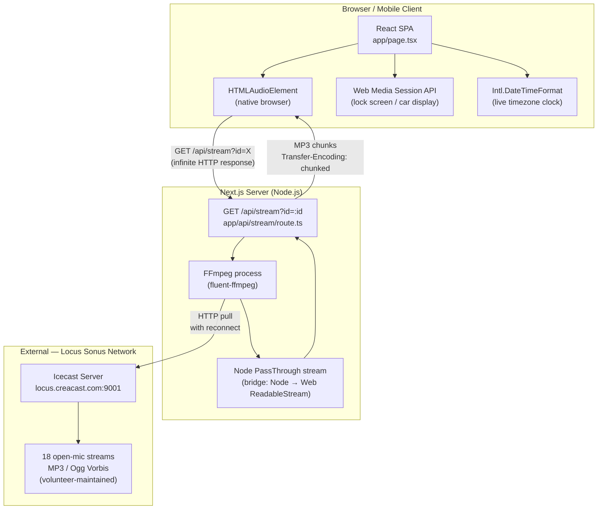
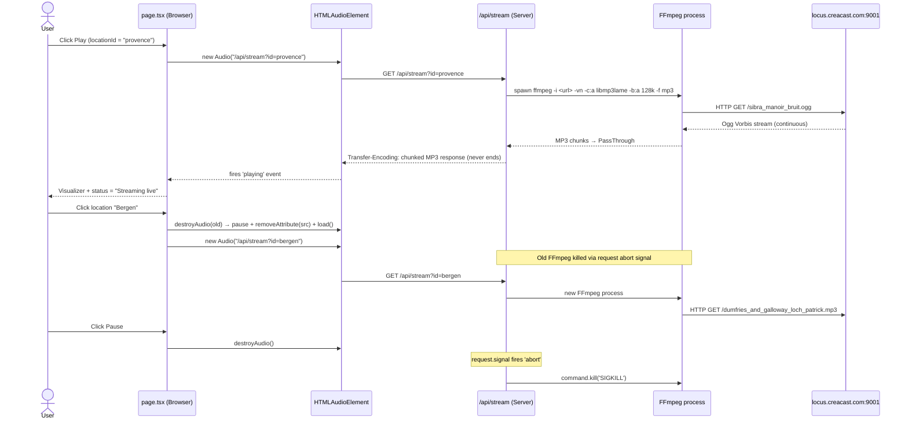
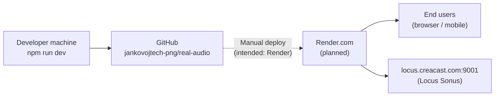
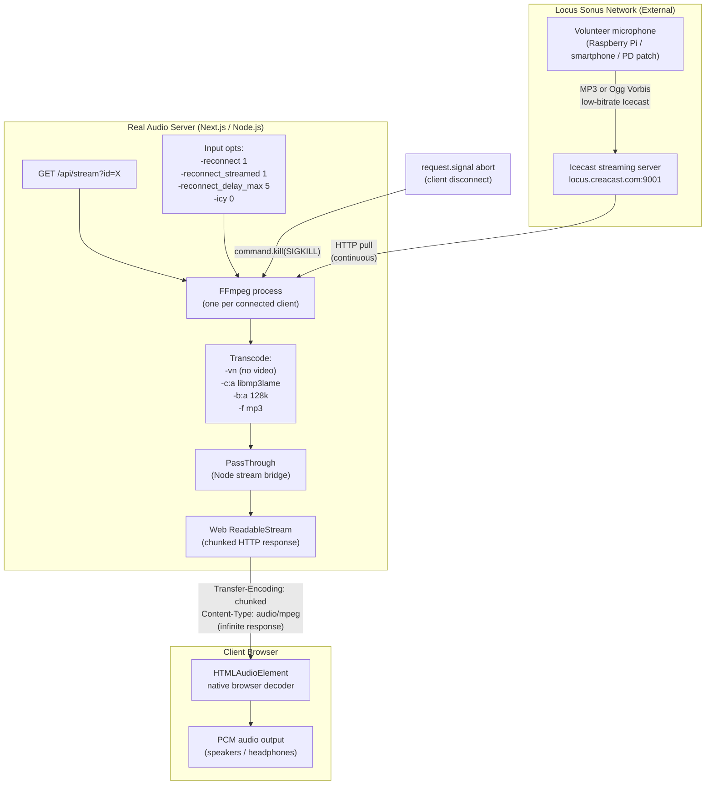

# Real Audio — Architecture

---

## 5. Technical Architecture

### Stack overview

| Layer | Technology | Version |
|-------|-----------|---------|
| Framework | Next.js (App Router) | 16.2.7 |
| Language | TypeScript | 6.0.3 |
| Runtime | Node.js | ≥18 (Next.js requirement) |
| UI library | React | 19.2.7 |
| Styling | Tailwind CSS | 4.3.0 |
| CSS processor | PostCSS + @tailwindcss/postcss | 4.3.0 |
| Audio transcoding | FFmpeg (OS binary) + fluent-ffmpeg | 2.1.3 |
| Linter | ESLint (next/core-web-vitals + next/typescript) | 9.x |
| Package manager | npm | — |

**No database.** **No authentication.** **No state management library.** **No third-party UI component library.**

---

### System architecture diagram



---

### Request lifecycle (one stream play)



---

### Frontend architecture

The entire frontend is a **single React client component** (`app/page.tsx`). There is no routing beyond the root `/` page.

```
app/page.tsx
├── LOCATIONS[]           — static array, 18 entries, all metadata
├── CATEGORY_META{}       — visual theme per category
├── ARTWORK{}             — SVG data-URI artwork for Media Session
├── formatLocalTime()     — Intl.DateTimeFormat helper
├── destroyAudio()        — safe HTMLAudioElement teardown
└── HomePage (component)
    ├── State
    │   ├── playState       — 'idle' | 'loading' | 'playing' | 'error'
    │   ├── errorMessage    — string
    │   ├── visualizerActive — boolean
    │   ├── activeId        — string (location ID)
    │   └── now             — Date | null (clock)
    ├── Refs
    │   ├── audioRef        — HTMLAudioElement
    │   ├── activeIdRef     — mirror of activeId for stale-closure safety
    │   └── playStateRef    — mirror of playState
    ├── Effects
    │   ├── clockEffect     — tick() aligned to minute boundary
    │   ├── mediaMetadata   — updates MediaSession.metadata on state/id change
    │   ├── mediaHandlers   — registers play/pause/prev/next once on mount
    │   └── unmountCleanup  — stopStream() on unmount
    ├── Callbacks
    │   ├── startStream(id) — creates Audio, attaches events, calls play()
    │   └── stopStream()    — destroyAudio() + reset state
    └── Render
        ├── Ambient glow (category-conditional radial gradient)
        ├── Pulsing rings (animate-ping, 3 layers)
        ├── Title block
        ├── Play/Pause button (3 visual states)
        ├── Status text + Retry button
        └── Location list (grouped: Nature / Urban)
            └── LocationRow × 18
                ├── Live dot (glowing when streaming)
                ├── Label + description
                └── Region + local time (HH:MM, tabular-nums)
```

### Backend architecture

The backend is a **single Next.js route handler** (`app/api/stream/route.ts`).

```
app/api/stream/route.ts
├── STREAMS{}        — 18 entries: id → { url, label }
├── DEFAULT_ID       — 'provence'
└── GET(request)
    ├── Read ?id param → resolve STREAMS[id]
    ├── Spawn FFmpeg
    │   ├── Input: Icecast URL
    │   ├── Options: -reconnect 1, -reconnect_streamed 1, -reconnect_delay_max 5, -icy 0
    │   ├── Output: libmp3lame, 128kbps, mp3
    │   └── Pipe → PassThrough
    ├── Wire request.signal → command.kill('SIGKILL') on client disconnect
    ├── Wrap PassThrough → Web ReadableStream
    └── Return Response(readableStream, { Content-Type: audio/mpeg, Transfer-Encoding: chunked })
```

### Infrastructure (current)



**Currently:** Deployed only to localhost. GitHub repo exists. Render deployment is planned but not yet configured.

**Critical dependency:** The host machine (dev or Render) must have `ffmpeg` binary installed at the system PATH.

### Third-party integrations

| Service | Purpose | Cost | SLA | Failure impact |
|---------|---------|------|-----|----------------|
| Locus Sonus / locus.creacast.com:9001 | All 18 audio streams | Free (art project) | None | All streams fail simultaneously |
| GitHub (jankovojtech-png/real-audio) | Source control | Free | GitHub SLA | Development blocked |
| Render.com | Planned hosting | TBD | TBD | Service unavailable |

### No integrations currently active for:

- Authentication (Auth0, Clerk, etc.)
- Database (Postgres, SQLite, etc.)
- Analytics (Posthog, Plausible, etc.)
- Error tracking (Sentry, etc.)
- CDN (Cloudflare, etc.)
- Email (Resend, SendGrid, etc.)
- Payments (Stripe, etc.)
- Monitoring (Datadog, etc.)

---

## Sound streaming architecture (dedicated)



**Key characteristics:**
- **One FFmpeg process per client** — not shared; does not scale
- **No caching** — every play request hits Locus Sonus
- **Transcoding on every request** — even if source is already MP3, re-encoding ensures consistent 128kbps output and strips Icecast metadata frames
- **Infinite HTTP response** — the browser `<audio>` element handles as a live stream; `preload="none"` prevents pre-buffering
- **Latency** — approximately 2–8 seconds from source mic to speaker (Icecast buffer + FFmpeg startup + network RTT)
- **Reconnect** — FFmpeg `-reconnect` flags handle brief Icecast dropouts automatically
