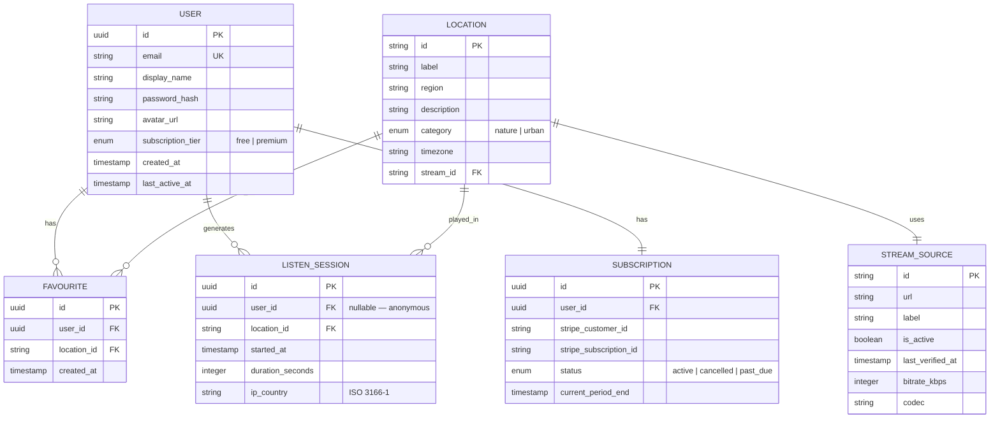
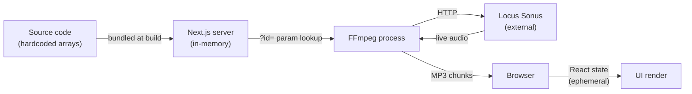

# Real Audio — Database Documentation

---

## 7. Database Documentation

### Current state

> **There is no database in this project.**

The application has zero persistent storage. All data is either:
- **Hardcoded** in source files (`LOCATIONS[]` in `page.tsx`, `STREAMS{}` in `route.ts`)
- **Ephemeral** in browser memory (React state, `HTMLAudioElement` ref)
- **External** and read-only (Locus Sonus Icecast streams)

No environment variables define a database connection. No ORM, no migration framework, no schema files exist anywhere in the repository.

---

### Entity Relationship Diagram (aspirational — what a full-featured version would need)

---

### Recommended database for future implementation

Given the application's characteristics (low write volume, high read volume, simple relational structure, potential for JSON preferences storage), the recommended stack is:

| Option | Recommendation | Rationale |
|--------|---------------|-----------|
| **Neon Postgres** (Vercel/Render) | ✅ First choice | Serverless, zero cold-start, free tier, Drizzle ORM compatible |
| SQLite (via Turso) | ✅ Alternative | Edge-compatible, ultra-cheap, ideal for early stage |
| Supabase | ✅ Alternative | Includes auth, realtime, and storage in one service |
| MongoDB | ❌ Not recommended | Overkill for this relational data model |

---

### Static data currently managed in code

The following "tables" are currently hardcoded in source files and would need to be moved to a database as the app grows:

#### `LOCATIONS` (in `app/page.tsx`)

| Field | Type | Example |
|-------|------|---------|
| id | string (PK) | `"provence"` |
| label | string | `"Provence"` |
| region | string | `"France"` |
| description | string | `"South French countryside"` |
| category | `'nature' \| 'urban'` | `"nature"` |
| timezone | IANA string | `"Europe/Paris"` |

Currently: 18 rows. Growth requires a code deploy.

#### `STREAMS` (in `app/api/stream/route.ts`)

| Field | Type | Example |
|-------|------|---------|
| id | string (PK) | `"provence"` |
| url | string | `"http://locus.creacast.com:9001/sibra_manoir_bruit.ogg"` |
| label | string | `"Sibra, Ariège, France"` |

Currently: 18 rows. **Note: 3 duplicate URL collisions** (see TECH_DEBT.md).

---

### Data flow in current system

No data persists between requests. No user data is collected. No cookies are set.
