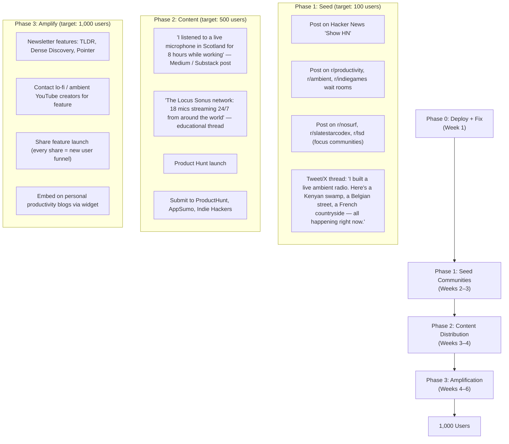

# Real Audio — Growth Plan

> Role: Growth Expert + Startup Founder
> Goal: 1,000 users → 10,000 users → 100,000 users

---

## Fastest Path to 1,000 Users

### Timeline: 4–6 weeks from first public deployment

The core insight: **Real Audio does not need a marketing budget to reach 1,000 users. It needs one piece of shareable, remarkable content and distribution to the right niche communities.**

### The Acquisition Stack (ordered by expected conversion)



### Channel-by-channel breakdown

#### 1. Hacker News "Show HN" — Expected: 200–500 visitors on launch day
**Why it works:** The technical story (FFmpeg proxy + Locus Sonus + Media Session API on a 2-file codebase) is intrinsically interesting to HN. The demo is the pitch — a live mic from Kenya or a Belgian cobblestone street.

**Post title:**
> "Show HN: Real Audio – I stream live open microphones from 18 places worldwide. No loops. No AI."

**Required before posting:**
- Fix duplicate streams
- Add `/api/stream/health` endpoint
- Deploy to Render with custom domain

**Expected conversion to regular users:** 3–8%

---

#### 2. Product Hunt launch — Expected: 300–800 visitors
**Launch strategy:**
- Launch Tuesday or Wednesday (peak traffic days)
- Tagline: *"18 live microphones from around the world, streaming right now."*
- GIF showing the dark UI, location switch, and lock screen Media Session artwork
- Maker comment explaining the Locus Sonus open-microphone network
- Ask for upvotes from developers, ambient music fans, and productivity communities

**Required additions before PH:**
- PWA manifest (so users can install from the PH page)
- Share button (so users can share specific locations)
- A "Featured" section with 4–5 best locations (don't make users scroll all 18 immediately)

---

#### 3. Reddit seeding — Expected: 100–300 visitors per post
**Top subreddits by fit:**

| Subreddit | Subscribers | Why it fits | Approach |
|-----------|------------|------------|---------|
| r/productivity | 3.5M | Focus audio is core use case | "I've been using live ambient mics instead of lo-fi playlists while working" |
| r/ambient | 180K | Exact target audience | Show HN-style post about the tech + experience |
| r/nosurf | 250K | Anti-distraction community | "Found this app that plays real-world audio — no algorithm, no UI, just sound" |
| r/lsd | 22K | Focus + productivity space | Organic share |
| r/slatestarcodex | 300K | Thoughtful tech/productivity | Long post about the Locus Sonus project + app |
| r/meditationpractice | 200K | Mindfulness use case | "This replaced my meditation app background sounds" |
| r/weddingplanning | 3M | Background ambient for venues | Wide demographic reach |

---

#### 4. X / Twitter thread — Expected: 500–2,000 impressions, 50–100 clicks
**Thread structure:**
```
Tweet 1: "I built a live ambient radio. Right now you can hear:
— a chalk stream in Sussex, England
— a cobblestone street in Brussels
— a kenyan swamp at 3am local time
— a French countryside manor in full summer

No loops. No AI. Real microphones. Real places."

Tweet 2: [Screenshot of UI with Kenya selected, 03:47 showing]

Tweet 3: "It runs on a tiny codebase: one FFmpeg proxy route, one React page.
The audio comes from the Locus Sonus soundmap — an art project running 
open microphones worldwide since 2006."

Tweet 4: "My favourite part: your phone's lock screen shows what you're listening to.
[Screenshot of iOS lock screen with 'Dunga Swamp, Kenya — Nature · Real Audio']"

Tweet 5: "Built with Next.js 16, fluent-ffmpeg, Web Media Session API.
The whole thing is ~760 lines.
Try it: [link]
Code: [github link]"
```

---

#### 5. Newsletter cold outreach — Expected: 500–2,000 readers reached per feature

| Newsletter | Audience | Fit | Pitch angle |
|-----------|---------|-----|------------|
| Dense Discovery | 30K designers/thinkers | High | "A live microphone radio for the world's ambient texture" |
| Pointer | 20K developers | Medium | Tech story: FFmpeg proxy, Media Session API |
| TLDR Newsletter | 800K tech | Medium | "Developer builds live ambient audio from 18 global mics" |
| Sidebar.io | 50K designers | High | UI/design showcase |
| Hacker Newsletter | 50K developers | High | Link from Show HN post |
| Calm Commerce | 10K wellness entrepreneurs | Very High | "The anti-loop ambient audio app" |

---

### Growth funnel targets

| Stage | Metric | Target (week 6) |
|-------|--------|----------------|
| Visitors | Unique sessions | 5,000 |
| Activation | Started a stream | 60% (3,000) |
| Retention D1 | Returned next day | 25% (750) |
| Retention D7 | Returned within week | 15% (450) |
| Retention D30 | Monthly active | 10% (300) |
| Sharing | Used share feature | 5% (150 shares) |
| **Goal** | **Monthly active users** | **1,000** |

---

## Path to 10,000 Users

**Timeline:** 2–4 months after 1,000 users milestone.

At 1,000 users, you have enough data to know: which locations are most played, what time of day, from which countries. Use this to guide:

### Strategies for 10K

#### 1. Loop amplification (most efficient)
Every share button click is a free acquisition event. At 1,000 users with 5% sharing = 50 shares/month × 3 clicks per share = 150 new visitors/month organically. Optimise share:
- Pre-populate share text: *"Listening to a live mic in Sussex, England right now — real-audio.com"*
- Share card shows current local time of location (dynamic OG image)
- Shareable embed for Notion/Obsidian pages (huge productivity community)

#### 2. SEO content play
Write 18 articles: *"What does [location] sound like right now?"* — one per stream. Each article embeds the live player. Long-tail search: "ambient sounds Scotland forest", "live rain sounds England", "ambient city sounds Seoul". These are high-intent, low-competition keywords.

#### 3. Partner with lo-fi / ambient YouTube creators
There are 50+ YouTube channels with 100K–2M subscribers playing ambient/lo-fi content. Approach them to embed Real Audio or mention it as an alternative. Offer affiliate deal (15% of premium revenue from referred users).

#### 4. Productivity tool integrations
Integrate with:
- **Notion** — embed block for `/real-audio`
- **Arc Browser** — featured in sidebar
- **Raycast** — extension to start a stream with keyboard shortcut

#### 5. App stores
At 10K users, the product should be a native mobile app (Expo). iOS App Store and Google Play unlock: organic search traffic, App of the Day potential, review sites (AppAdvice, etc.).

---

## Viral Growth Loops

### Loop 1: Share-to-play (strongest, build first)

```
User plays stream → Clicks "Share [Location]" → 
Friend receives link → Lands on page with pre-selected location → 
Hears the same real-time audio → "This is incredible" → 
Becomes user → Shares their own location
```

**Mechanics:**
- Share URL: `real-audio.com/?loc=kisumu&shared=1`
- When `?shared=1`: show subtle banner "Shared by a listener in [sharer's rough location]"
- Auto-start audio on arrival (using the shared location as default)
- Show the local time in the sharer's location and the shared location simultaneously

**Amplification:** The emotional moment of "someone who has never been to Kenya is sharing a live 3am Kenyan swamp sound with me" is inherently worth talking about.

---

### Loop 2: Collectible locations (medium-term)

```
User listens to a location for 10+ minutes → 
Unlocks "I've been here" badge → 
Profile shows world map with visited acoustic spots → 
User shares map → 
New user wants to "travel" too → signs up
```

**Mechanics:**
- After 10 minutes on a location: subtle notification "You've explored 3 of 18 locations"
- Profile page shows a minimal world map with glowing dots for visited locations
- Shareable card: "I've listened to 12 places around the world. Start your journey →"

---

### Loop 3: Collaborative listening (longer-term)

```
User creates a "listening session" → 
Shares session link with friends → 
Everyone hears the same stream synchronised → 
Group experience drives social sharing and word-of-mouth
```

**Mechanics:**
- Session URL: `real-audio.com/session/abc123`
- All participants in session hear same stream, switch at same time
- Listener count visible: "3 people are listening to Bergen right now"
- Real-time chat overlay (optional, opt-in)

---

### Loop 4: Context-aware distribution

```
App shows "It is currently 3:47 AM in Kenya" while streaming → 
User screenshots this → posts on social media → 
Curiosity-driven clicks from people who see the post → 
New users discover app
```

**This loop is already partially active** — the live clock is implemented. It just needs a "screenshot mode" or a share button that generates a card image.

---

### Loop 5: Creator / streamer endorsement

```
Productivity YouTuber mentions Real Audio as their focus tool → 
Their audience of 200K+ discovers the app → 
A percentage installs PWA / bookmarks → 
Some become vocal advocates in their own communities
```

**Mechanics:** Identify 20 productivity / deep work YouTube channels. Send personalised DM with free premium code. Provide "as used by [creator]" badge for their content.

---

## Key Metrics to Track

| Metric | Target | Why it matters |
|--------|--------|---------------|
| **Activation rate** (% of visitors who press Play) | >55% | Core product promise delivered |
| **D1 retention** (returned next day) | >20% | Habit-forming signal |
| **Session length** (avg minutes per session) | >18 min | Validates use case (focus/sleep) |
| **Share rate** (% of sessions with a share event) | >3% | Viral coefficient driver |
| **Location diversity** (avg locations tried per user) | >2.5 | Exploration signal → retention |
| **Streak** (listened on N consecutive days) | Track distribution | Habit formation |
| **PWA install rate** | >8% of mobile users | Retention predictor |
| **K-factor** (new users from shares per user) | >0.3 | Organic growth rate |

At K-factor ≥ 1.0, the product grows without any marketing spend.
