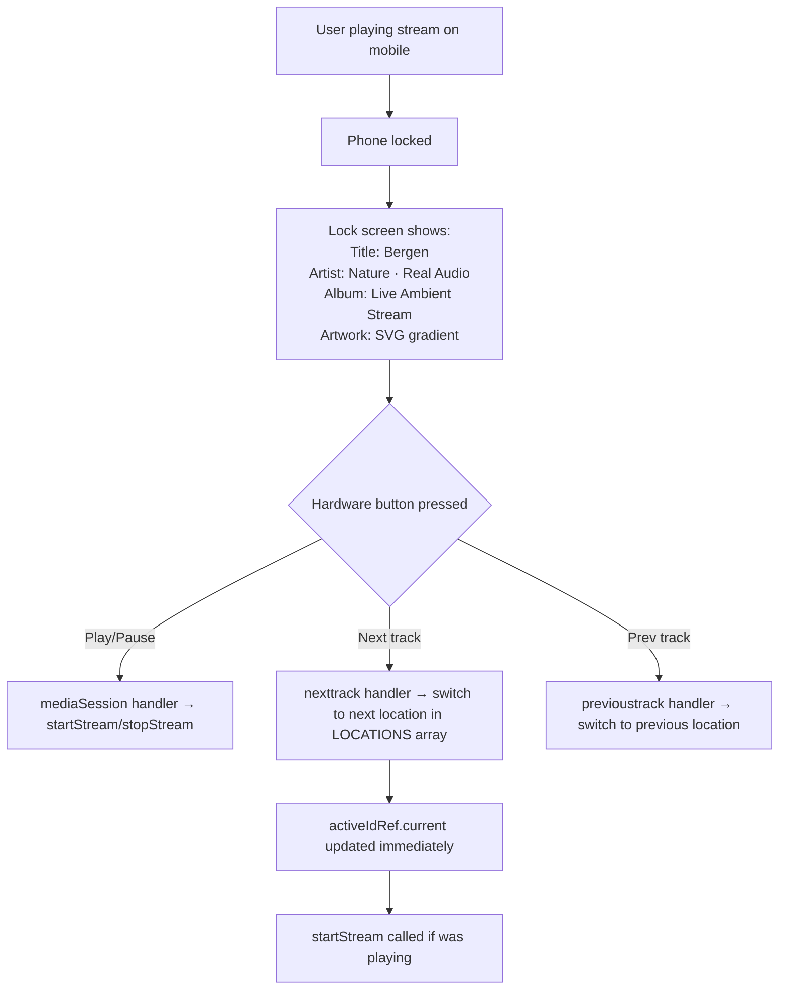

# Real Audio — Complete Handover Document

> For onboarding a new developer, senior engineering team, or investor technical review.
> Audit date: June 2026. Repository: `jankovojtech-png/real-audio`.

---

## 1. Executive Summary

**Real Audio** is a live ambient audio streaming web application. It is the only ambient audio product that streams genuinely live, unedited soundscapes from real physical locations around the world — not loops, not AI-generated audio, not studio recordings.

The technology works by proxying Locus Sonus Icecast streams (volunteer open-microphone network, active since 2006) through a server-side FFmpeg process that re-encodes the audio to consistent MP3 before streaming it to the browser. The user interface is a single dark, minimalist React page with a location selector, play/pause control, live local time per location, and full Web Media Session API integration for lock-screen and car display control.

**Current state:** Fully functional MVP. Zero database, zero authentication, zero CI/CD, zero tests, zero monitoring. Ready for early user testing and investor demonstrations. Requires 2–4 weeks of engineering effort to reach production-readiness.

---

## 2. Product Overview

### Value proposition
> *"Hear the world, live. No loops. No AI. No studio. Just an open microphone, somewhere on Earth, right now."*

### Target users
- Remote workers seeking authentic focus audio
- Meditation / mindfulness practitioners
- Virtual travellers
- Car commuters (Media Session hardware control)
- Sleep seekers who find nature loops unconvincing

### Key differentiators vs Calm / Brain.fm / Endel
- **Live** — not recorded or generated
- **Free** — no account, no paywall, instant start
- **Geographic** — real place, real time, real local clock
- **Car-native** — lock screen + steering wheel controls work out of the box

---

## 3. Feature Inventory

| # | Feature | Status | File(s) |
|---|---------|--------|---------|
| F-01 | Live audio streaming (FFmpeg proxy) | ✅ Working | `app/api/stream/route.ts` |
| F-02 | 18 curated global locations | ✅ Working | `app/page.tsx`, `app/api/stream/route.ts` |
| F-03 | Nature / Urban category grouping | ✅ Working | `app/page.tsx` |
| F-04 | Category-adaptive UI theme (indigo/amber) | ✅ Working | `app/page.tsx` |
| F-05 | Seamless location switching (no reload) | ✅ Working | `app/page.tsx` |
| F-06 | Live local time per location | ✅ Working | `app/page.tsx` |
| F-07 | Web Media Session API (lock screen / car) | ✅ Working | `app/page.tsx` |
| F-08 | Hardware controls (play/pause/prev/next) | ✅ Working | `app/page.tsx` |
| F-09 | SVG lock-screen artwork (category-specific) | ✅ Working | `app/page.tsx` |
| F-10 | Pulsing ambient visualizer rings | ✅ Working | `app/page.tsx` |
| F-11 | Safe audio teardown (no empty-src error) | ✅ Working | `app/page.tsx` |
| F-12 | Retry on stream error | ✅ Working | `app/page.tsx` |
| F-13 | Accessibility (aria-label, aria-pressed, focus-visible) | ✅ Working | `app/page.tsx` |
| F-14 | SSR-safe hydration (clock null on server) | ✅ Working | `app/page.tsx` |
| F-15 | FFmpeg reconnect on upstream drop | ✅ Working | `app/api/stream/route.ts` |
| F-16 | Client-disconnect → FFmpeg kill | ✅ Working | `app/api/stream/route.ts` |
| F-17 | Dark ambient theme (Tailwind v4) | ✅ Working | `app/page.tsx`, `app/globals.css` |
| F-18 | User accounts / authentication | ❌ Not built | — |
| F-19 | Favourites | ❌ Not built | — |
| F-20 | Listening history | ❌ Not built | — |
| F-21 | Database | ❌ Not built | — |
| F-22 | Volume control | ❌ Not built | — |
| F-23 | Sleep timer | ❌ Not built | — |
| F-24 | PWA manifest / home screen install | ❌ Not built | — |
| F-25 | Stream health monitoring | ❌ Not built | — |
| F-26 | Rate limiting | ❌ Not built | — |
| F-27 | Error tracking (Sentry) | ❌ Not built | — |
| F-28 | Analytics | ❌ Not built | — |
| F-29 | CI/CD pipeline | ❌ Not built | — |
| F-30 | Audio visualizer (frequency bars) | ❌ Not built | — |
| F-31 | Search / filter | ❌ Not built | — |
| F-32 | Subscription / payments | ❌ Not built | — |
| F-33 | Mobile native apps | ❌ Not built | — |

---

## 4. User Flow Mapping

### First launch
```mermaid
flowchart TD
    A[User visits /] --> B[Page renders:\ndark bg, title, play button\n18 locations, clocks showing]
    B --> C{User action}
    C --> D[Clicks Play] --> E[startStream('provence')]
    C --> F[Clicks a location] --> G[setActiveId + optionally startStream]
    E --> H[Audio loading: spinner]
    H --> I{Stream connects?}
    I -->|Yes| J[Audio playing:\nvisualizer, indigo glow, status: Streaming live]
    I -->|No| K[Status: error message + Retry button]
    J --> L[User clicks Pause] --> M[destroyAudio + idle state]
    J --> N[User clicks different location] --> O[destroyAudio + startStream new id]
```

### Location switching
```mermaid
flowchart TD
    A[Playing: Provence] --> B[User taps Bergen]
    B --> C[handleLocationSelect('bergen')]
    C --> D[setActiveId('bergen')]
    C --> E{Currently playing?}
    E -->|Yes| F[startStream('bergen')]
    F --> G[destroyAudio(old audio element)]
    G --> H[new Audio('/api/stream?id=bergen')]
    H --> I[old FFmpeg killed via abort signal]
    H --> J[new FFmpeg starts → loch_patrick.mp3]
    J --> K[Playing: Bergen]
    E -->|No| L[just updates selection visually]
```

### Lock screen / car control


---

## 5. Technical Architecture (summary)

```
Browser (React SPA)
  └── app/page.tsx (607 lines, single client component)
        ├── State: playState, activeId, errorMessage, visualizerActive, now
        ├── Refs: audioRef, activeIdRef, playStateRef
        ├── useEffect (clock): minute-aligned interval, client-only
        ├── useEffect (Media Session metadata): reruns on state/id change
        ├── useEffect (Media Session handlers): once-on-mount, ref-based
        ├── useCallback startStream(id): creates Audio, wires events
        ├── useCallback stopStream(): destroyAudio + reset state
        └── Render: dark ambient UI with 18-row location list

Server (Next.js App Router, Node.js runtime)
  └── app/api/stream/route.ts (137 lines)
        ├── STREAMS{}: 18 entries, id → { url, label }
        ├── GET handler: read ?id, spawn ffmpeg, bridge Node→Web stream
        ├── FFmpeg: -reconnect, -icy 0, libmp3lame 128k, mp3 format
        └── Cleanup: request.signal abort → SIGKILL

External dependency
  └── locus.creacast.com:9001 (Locus Sonus Icecast server)
        └── 18 open-mic streams (MP3 / Ogg Vorbis, volunteer-maintained)
```

---

## 6. Source Code Structure

```
real-audio/
├── .git/                      Git repository
├── .gitignore                 node_modules, .next, build, .env*.local
├── app/                       Next.js App Router source
│   ├── api/
│   │   └── stream/
│   │       └── route.ts       THE ONLY BACKEND FILE (137 lines)
│   ├── globals.css            "@import tailwindcss" — single line
│   ├── layout.tsx             Root layout + metadata (18 lines)
│   └── page.tsx               THE ONLY FRONTEND FILE (607 lines)
├── docs/                      Handover documentation (this folder)
├── eslint.config.mjs          ESLint flat config (next/core-web-vitals)
├── next-env.d.ts              Auto-generated Next.js TS types (do not edit)
├── next.config.ts             serverExternalPackages: ['fluent-ffmpeg']
├── package.json               Dependencies + npm scripts
├── package-lock.json          Lockfile (node v25 generated)
├── postcss.config.mjs         @tailwindcss/postcss plugin
└── tsconfig.json              strict: true, bundler moduleResolution
```

**Total source code: ~760 lines across 2 meaningful files.**

---

## 9. Authentication & Security Audit

### Current state: No authentication

There is zero authentication anywhere in the codebase. The application is fully anonymous.

### Security analysis

| Risk | Severity | Details |
|------|----------|---------|
| No rate limiting | CRITICAL | `GET /api/stream` spawns unlimited FFmpeg processes per client. A single HTTP flood can exhaust server resources. |
| CORS `*` on streaming endpoint | HIGH | `Access-Control-Allow-Origin: *` allows any domain to embed the audio stream. |
| `fluent-ffmpeg` deprecated | HIGH | No security patches. Any future FFmpeg wrapper vulnerability is unpatched. |
| No HTTPS enforcement | MEDIUM | No HSTS headers, no forced redirect to HTTPS in config. |
| No CSP headers | MEDIUM | No Content Security Policy defined. |
| Source URLs server-side | LOW (good) | Locus Sonus Icecast URLs are never exposed to the client. |
| No user data | LOW (good) | Zero PII collected. No GDPR exposure in current state. |
| No secrets in codebase | LOW (good) | No API keys, no tokens, no credentials in source. |

**Security score: 3/10** — acceptable for an anonymous audio demo, unacceptable for a production product with users.

---

## 10. Infrastructure Audit

### Current state

| Component | Status | Notes |
|-----------|--------|-------|
| Hosting | ❌ None live | Runs only on developer's machine via `npm run dev` |
| Production domain | ❌ None | No custom domain configured |
| CI/CD | ❌ None | No automated build, test, or deploy |
| Monitoring | ❌ None | No uptime monitoring, no alerts |
| Error tracking | ❌ None | console.log/error only |
| Analytics | ❌ None | No usage data |
| CDN | ❌ None | All assets served from Next.js server |
| SSL/TLS | Inherited | Will be provided by Render/Vercel when deployed |
| Backups | N/A | No database to back up |

### Recommended deployment (Render.com)

```yaml
# render.yaml (to be created)
services:
  - type: web
    name: real-audio
    env: node
    buildCommand: "apt-get install -y ffmpeg && npm ci && npm run build"
    startCommand: "npm start"
    envVars:
      - key: NODE_ENV
        value: production
    healthCheckPath: /api/stream/health  # needs to be created
```

**Key requirement:** The Render build environment must install `ffmpeg`. On Render, this can be done via the `buildCommand` with `apt-get`, or by using a custom Docker image.

---

## 11. Sound Streaming System Analysis

### Where sounds come from
All 18 streams originate from the **Locus Sonus Soundmap** (`http://locusonus.org/soundmap/`), a global network of permanently broadcasting open microphones maintained by volunteer sound artists, researchers, and enthusiasts since 2006. The Icecast server is hosted at `locus.creacast.com:9001`. Streams are free, unmetered, and require no authentication.

### Audio formats (at source)
- 14 streams: **MP3** (various bitrates: 56–160 kbps)
- 4 streams: **Ogg Vorbis** (up to 192 kbps)

### What the server does to the audio
All source formats are re-encoded to a uniform **MP3 at 128 kbps** using `libmp3lame` in FFmpeg. This adds ~2–5 seconds of latency but ensures:
- Consistent format for all browsers
- Icecast metadata frames stripped (via `-icy 0`)
- Any video track stripped (via `-vn`)

### Latency sources
| Source | Typical delay |
|--------|--------------|
| Microphone → Icecast server (volunteer hardware) | 1–5s |
| FFmpeg startup | 0.5–2s |
| FFmpeg transcode buffer | 0.5–2s |
| Network (server → browser) | 50–500ms |
| Browser audio buffer | 0.5–2s |
| **Total end-to-end** | **3–12 seconds** |

### Scalability
- **1–10 users:** Works fine on any $5/month VPS
- **~50 users:** CPU bottleneck on a single 1-core server (each FFmpeg uses 5–15% of a core)
- **100+ users:** Must implement stream sharing (one FFmpeg per unique stream ID, not one per client)
- **1,000+ users:** Must implement CDN relay (Icecast relay chain, or HLS re-packaging to Cloudflare Stream / Mux)

---

## 12. Business Logic Audit

### Current business rules

1. **No user state** — every session starts fresh, anonymous
2. **Default location** — `provence` (Sibra, Ariège, France) loads pre-selected on first visit
3. **Location ordering** — Nature first (11), then Urban (7), in fixed hardcoded order
4. **Category theming** — Nature → indigo palette; Urban → amber palette
5. **Fallback ID** — unknown `?id=` values silently fall back to `provence`
6. **Single active stream** — starting a new stream always destroys the previous one
7. **Streaming is always live** — no VOD, no on-demand, no seek

### Missing business logic (not implemented)
- No free tier / premium tier distinction
- No per-user stream limits
- No admin capabilities
- No content moderation
- No abuse detection

---

## 17. Scalability Assessment

| Users | Expected behavior | Primary bottleneck | Monthly infra cost estimate |
|-------|------------------|-------------------|---------------------------|
| 100 | Fine on $25/month Render instance | None | ~$25 |
| 1,000 | Degraded: 1,000 FFmpeg processes, likely OOM | Server RAM/CPU | ~$200–500 |
| 10,000 | Not functional without stream sharing | Architecture (no mux) | ~$2,000–5,000 (with fix) |
| 100,000 | Not functional without CDN relay | Bandwidth, Icecast source limits | ~$5,000–20,000 (with CDN) |
| 1,000,000 | Requires full CDN, edge caching, stream relay network | Locus Sonus source limits | ~$50,000+/month |

**Critical note:** Locus Sonus is a volunteer-run art server. It does not SLA, does not support commercial traffic, and has no stated rate limits. At 10,000 users all hitting the same 18 source URLs, the Locus Sonus server itself becomes the bottleneck — independent of Real Audio's infrastructure. A production deployment **must** implement a relay layer that pulls each stream once and re-distributes.

---

## 19. Knowledge Transfer Summary

### If a new developer joins tomorrow, what must they know?

1. **The entire backend is one file** (`app/api/stream/route.ts`) and the entire frontend is one file (`app/page.tsx`). Read both in full before touching anything.
2. **FFmpeg must be installed on the host machine** — not in `node_modules`, not auto-installed by npm. `npm run dev` will fail silently if it isn't there.
3. **All audio comes from one external server** (`locus.creacast.com:9001`) that is a volunteer art project with no SLA. If it's down, everything is down.
4. **Three stream IDs share duplicate URLs** — `lisbon`=`brussels` and `bangkok`=`seoul`. These play identical audio despite different UI labels. This is a known issue.
5. **The `fluent-ffmpeg` package is deprecated** — it works but will not receive security patches.
6. **There is no database, no auth, no tests, no CI/CD, no monitoring.** The app is a functional demo, not a production service.
7. **Media Session handlers are set up once on mount** using a ref pattern to avoid stale closures. Do not put them in a `useEffect` with `activeId` as a dependency — this causes flicker on car displays.
8. **`destroyAudio()`** must always be used instead of `audio.src = ''` to avoid `MEDIA_ELEMENT_ERROR: EMPTY SRC ATTRIBUTE`. This is a hard browser quirk.
9. **The clock (`now` state) initialises as `null` on server and is set only on the client** to avoid SSR hydration mismatch.
10. **`serverExternalPackages: ['fluent-ffmpeg']` in `next.config.ts`** is mandatory — without it, Next.js tries to bundle the package, which fails because it needs native binaries.

### Top 10 most important files

| # | File | Why critical |
|---|------|-------------|
| 1 | `app/page.tsx` | Entire frontend: 607 lines, all UI + audio + Media Session logic |
| 2 | `app/api/stream/route.ts` | Entire backend: 18 stream URLs + FFmpeg pipeline |
| 3 | `next.config.ts` | Without `serverExternalPackages`, the app doesn't build |
| 4 | `package.json` | All dependencies including the deprecated `fluent-ffmpeg` |
| 5 | `tsconfig.json` | `strict: true`, `bundler` moduleResolution — affects all TS compilation |
| 6 | `postcss.config.mjs` | Tailwind v4 requires `@tailwindcss/postcss` (not the v3 config pattern) |
| 7 | `app/layout.tsx` | Root layout; where global CSS and metadata live |
| 8 | `app/globals.css` | Single `@import "tailwindcss"` — removing this breaks all styling |
| 9 | `.gitignore` | Correctly excludes `.next` and `node_modules`; crucial for clean repo |
| 10 | `eslint.config.mjs` | Flat ESLint config; controls code quality rules |

### Top 10 most important systems

| # | System | Location | Risk if broken |
|---|--------|----------|---------------|
| 1 | FFmpeg stream pipeline | `route.ts` | Zero audio output |
| 2 | PassThrough → ReadableStream bridge | `route.ts` | Zero audio output |
| 3 | `startStream()` / `stopStream()` | `page.tsx` | Audio control broken |
| 4 | `destroyAudio()` teardown | `page.tsx` | Console error flood, memory leaks |
| 5 | Media Session handlers (mount-once, ref-based) | `page.tsx` | Car display / hardware controls broken |
| 6 | Minute-aligned clock | `page.tsx` | Timezone display broken |
| 7 | SSR-safe `now` initialization | `page.tsx` | Hydration mismatch in production |
| 8 | `request.signal` → FFmpeg kill | `route.ts` | FFmpeg process leak on disconnect |
| 9 | Locus Sonus Icecast server | External | All streams offline |
| 10 | FFmpeg binary on host | OS-level | Server fails to transcode |

### Top 10 risks

| # | Risk | Probability | Impact | Mitigation |
|---|------|------------|--------|-----------|
| R-01 | Locus Sonus server goes offline | Medium | Critical | Add health monitoring + fallback stream sources |
| R-02 | Resource exhaustion from too many concurrent users | High (at scale) | Critical | Implement stream multiplexing + rate limiting |
| R-03 | FFmpeg not installed on deploy target | High (new deploys) | Critical | Document dependency + add startup check |
| R-04 | `fluent-ffmpeg` security vulnerability | Low-Medium | High | Replace with direct `child_process.spawn` |
| R-05 | Duplicate stream URLs confuse users | Currently present | Medium | Fix: assign unique sources to `lisbon` and `bangkok` |
| R-06 | Single stream of any source goes offline | Medium (volunteers) | Low-Medium | Stream health check + UI badge |
| R-07 | Browser blocks autoplay policy | Low (user gesture required) | Low | Already handled: play() is called on user click |
| R-08 | Icecast metadata corruption in MP3 output | Low (mitigated by -icy 0) | Medium | `-icy 0` flag already applied |
| R-09 | Next.js 16 breaking changes in future versions | Low | Medium | Pin version; follow Next.js changelog |
| R-10 | Locus Sonus project shut down | Very Low | Catastrophic | Identify and onboard alternative stream networks |

### Top 10 opportunities

| # | Opportunity | Effort | Revenue potential |
|---|-------------|--------|-----------------|
| O-01 | Premium subscription ($4.99/month) with exclusive streams + AI features | 2w | High |
| O-02 | Stream multiplexing — enables 10x more concurrent users at same cost | 1w | Indirect (scalability unlock) |
| O-03 | PWA + home screen install — converts web visitors to daily active users | 2d | High (retention) |
| O-04 | Mobile apps (iOS/Android via Expo) — 10x addressable market | 6w | High |
| O-05 | AI sound blending — unique feature no competitor has | 3w | Moat / premium |
| O-06 | Contributor platform — scale to 1,000+ locations from community mics | 4w | High (content network effects) |
| O-07 | Embeddable widget for Notion, productivity tools | 1w | B2B distribution |
| O-08 | "Sleep" and "Focus" preset modes — increases daily use occasions | 3d | Premium feature |
| O-09 | Public API for developers — B2B revenue + developer ecosystem | 4w | Medium |
| O-10 | Wellness brand partnerships — spa apps, meditation apps licensing streams | 0 (BD only) | High |
