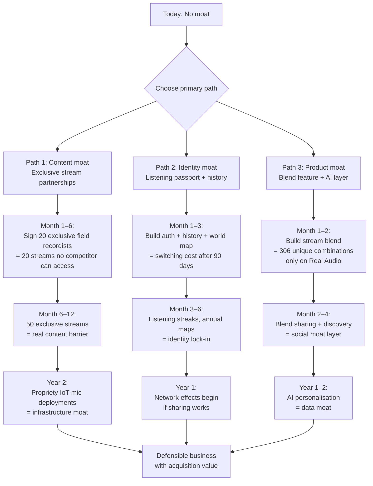

# Real Audio — Moat Analysis

> Role: YC Partner + VC Analyst
> Question: Is there a defensible business here?

---

## Current Moat Score: 2/10

This is not a criticism of the product quality — the product is good. This is an honest assessment of defensibility.

| Dimension | Score | Reason |
|-----------|-------|--------|
| Content exclusivity | 0/10 | All content from one public, unlicensed third-party server |
| Technology barrier | 1/10 | ~2 weeks for any competent developer to clone |
| Network effects | 0/10 | No user-to-user value creation yet |
| Brand recognition | 1/10 | Zero brand awareness, no users |
| Switching costs | 2/10 | None currently — no saved data, no identity |
| Data advantages | 0/10 | No users, no data |
| Distribution | 0/10 | No partnerships, no app stores, no SEO |
| Regulatory | N/A | Not applicable |

**Honest summary:** Real Audio has a compelling concept and zero moat. Any developer who reads a blog post about it could replicate it in a weekend.

---

## The Cloneability Test

How long would it take a competent developer to clone Real Audio from scratch?

```
1. Find Locus Sonus network → 30 minutes
2. Build FFmpeg proxy in Next.js → 4 hours
3. Build the React UI with location list → 8 hours
4. Add Media Session API → 2 hours
5. Deploy → 2 hours

Total: ~16–20 hours of focused work
```

A well-funded company (Calm, Spotify) could deploy a clone in 1 business week. This is not a hypothetical — it is the current reality.

**The only reason Calm hasn't done this yet:** The market is too small at current scale, and the Locus Sonus infrastructure is fragile. If Real Audio demonstrates that this is a $1M+ ARR business, expect a clone within 12 months.

---

## Moat-Building Strategies (ranked by impact and feasibility)

### Moat 1: Exclusive Content Network
**Type:** Content moat
**Feasibility:** High (3–6 months to first 20 exclusive streams)
**Instructions:**

Build relationships with field recordists, sound artists, and location owners who want their mic online 24/7. Offer them:
- 20–30% of subscription revenue attributable to their stream
- A "powered by Real Audio" branded player for their own website
- A profile page on Real Audio with their story and links

Target communities:
- [Wildlife Acoustics forum](https://www.wildlifeacoustics.com/community)
- [Soundcloud field recording tag](https://soundcloud.com/tags/field-recording)
- [Forum discussion at Nature Recordists](https://groups.google.com/g/naturerecordists)
- [Phonography International](http://phonography.org)
- Bandcamp ambient/field recording artists (search "binaural", "field recording", "soundscape")

**Milestone target:** 50 exclusive streams within 6 months.
**Cost:** $0 upfront. Revenue share only.
**Moat depth:** At 50 exclusive streams, a clone would need to replicate 50 individual artist relationships — not just copy code. This is a real barrier.

---

### Moat 2: Listening Identity / Acoustic Passport
**Type:** Switching cost moat
**Feasibility:** Very high (2–3 days engineering after auth is built)

The "world map of locations you've listened to" creates a data identity that users will not want to abandon. After 6 months of listening history, switching to a competitor means losing your entire acoustic travel log.

This is the same moat Spotify used with listening history and personalised playlists. It's not about the music — it's about the identity.

**Implementation:**
- Interactive SVG world map showing dots for listened locations
- "You've visited 12 of 18 locations" progress tracker
- Shareable card: "My acoustic world — 2026" annual summary
- Streak system: listened on N consecutive days

**Switching cost value:** After 90 days of consistent use, the listening history becomes a personal artifact. This is a soft lock-in that doesn't feel manipulative.

---

### Moat 3: The Blend Feature — Combinatorial Uniqueness
**Type:** Product uniqueness moat
**Feasibility:** High (1 week engineering)

18 locations × 17 possible blend partners = 306 unique combinations, each one a never-before-heard sound that cannot exist on any other platform. User-generated blend configurations ("my morning blend: 40% Scotland Forest + 60% Kyoto Garden") become shareable identity artifacts.

**Why this is hard to clone:** The blend feature requires:
- Stream multiplexing (sharing one FFmpeg process per ID)
- Real-time crossfade control
- UX for dual-stream selection and ratio control
- Social sharing of blend configurations

A clone can build this — but it takes 3–4 weeks, not a weekend. Combined with exclusive content, the blend library becomes unique to Real Audio.

---

### Moat 4: Proprietary IoT Microphone Network
**Type:** Infrastructure moat (the strongest possible moat)
**Feasibility:** Medium (6–18 months, requires capital)
**Cost:** $500–2,000 per location × 50 locations = $25K–100K

Deploy Real Audio's own microphones in 50 iconic locations — partnered with:
- Nature reserves and national parks
- Independent hotels and boutique accommodation
- Universities and art institutions
- Urban locations (markets, squares, transit hubs)

**Partnership pitch:**
> "We'll install a weatherproof microphone on your property. Your guests/visitors can tune in from anywhere in the world. You get a 'Live on Real Audio' badge and global exposure. We get an exclusive stream from your location."

**Why this creates an unbreakable moat:** You own the hardware. You have an exclusive agreement with the location. No competitor can access this stream, ever.

**Investor story:** "We're building the live audio layer of the internet. Think of us as the audio equivalent of webcam networks — except curated, beautiful, and embedded in a product people pay for."

---

### Moat 5: Community and Social Layer
**Type:** Network effects moat
**Feasibility:** Medium (4–6 weeks engineering)
**Timeline:** Month 3–6

If users can see how many people are listening to the same stream right now, recommend streams to friends, create listening sessions together, and share their acoustic discoveries — Real Audio becomes a place, not just a tool.

**Feature stack for this moat:**
- "14 people listening to Bergen right now"
- Shared listening sessions (same stream, synchronised, with text chat)
- Follow other users' listening profiles
- Discover "people like you also love..." recommendations

**Network effects mechanism:** More users → more social signal → more discovery → more users. Classic network effect. Currently entirely absent.

---

### Moat 6: Brand in an Uncontested Category
**Type:** Brand moat (the cheapest moat)
**Feasibility:** Very high (requires good content, not engineering)
**Timeline:** 12–18 months

If Real Audio becomes the word people use when they talk about live ambient audio — "I was listening to Real Audio while working" — then brand recognition itself becomes a defensive asset.

**Requirements:**
- Consistent brand voice: intelligent, honest, geographical, non-wellness-corporate
- Press coverage in productivity and design media (Fast Company, The Atlantic, Wirecutter)
- Creator endorsements (Tim Ferriss, CGP Grey, productivity YouTubers)
- A genuinely remarkable story: "The woman in Brno who doesn't know 2,000 people are listening to her city park"

---

## What Does NOT Create a Moat

These are common startup mistakes that look like moat-building but aren't:

### ❌ "We have the best UI"
UI can be cloned in hours. Dark + minimal is beautiful but not defensible. Any designer can replicate it.

### ❌ "We got to market first"
First-mover advantage in a category only matters if you use the time to build real defensibility (content, network effects, brand). Being first to exist is not a moat. Being first to matter is.

### ❌ "Our FFmpeg pipeline is well-engineered"
Every engineer who looks at the codebase can understand and replicate it. The elegance of the code is a quality signal, not a moat.

### ❌ "We have Locus Sonus"
Locus Sonus is public and equally accessible to any competitor. This is not a competitive advantage. It is a commodity content source.

### ❌ "18 locations is a lot"
It is not. A well-resourced competitor could source 18 public Icecast streams in a single afternoon. Content quantity is not a moat when the content source is open.

---

## Moat-Building Roadmap



**Recommendation:** Pursue all three paths in parallel. The content moat is the most important long-term (exclusive partnerships), the identity moat is the fastest to build (auth + history), and the product moat (blend) is the most differentiating for press and word-of-mouth.
