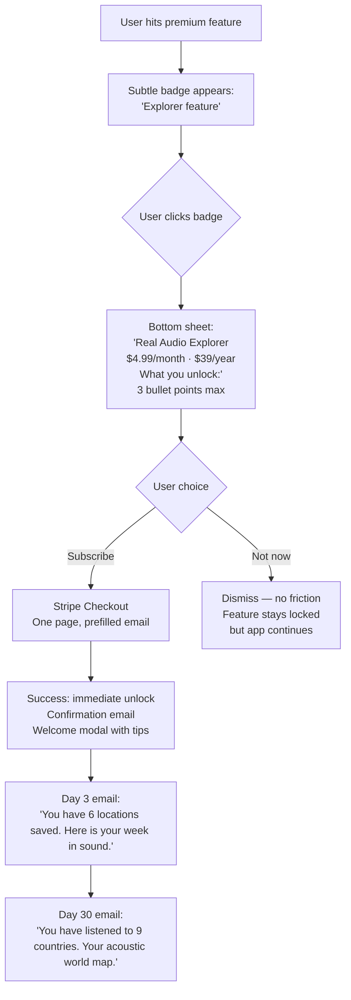

# Real Audio — Monetisation Strategy

> Role: Product Manager + Startup Founder
> Goal: $0 → first revenue → sustainable business

---

## Fastest Path to First Revenue

**Timeline: 6–8 weeks from today**

### The argument for not monetising too early

Real Audio has zero users today. The fastest path to revenue is through users — not through a paywall. A product with 500 engaged daily users and no paywall is worth more (as a fundraising story, acquisition target, or growth foundation) than a product with a paywall and 50 paying users.

**First revenue milestone: $500 MRR**
This is achievable with ~120 premium subscribers. To get 120 premium subscribers, you need approximately 2,000 monthly active users (assuming 6% conversion on a well-designed freemium model).

**Required before charging anything:**
1. ✅ The core product must work reliably (fix duplicate streams, deploy, health monitoring)
2. ✅ The retention hook must exist (favourites, sleep timer, history)
3. ✅ The user must have experienced value before seeing a paywall

---

## Freemium Model

### Design principle: Gate aspiration, not the core product

The worst freemium mistake is gating the thing that makes the product valuable. Real Audio's core value is **hearing live sound from a real place**. That must remain free forever.

What to gate: depth, personalisation, advanced features, and exclusivity.

### Free tier (forever)

| Feature | Details |
|---------|---------|
| All 18 locations | No limit, no ads |
| Play / Pause / Switch | Full control |
| Media Session API | Lock screen + car display |
| Live timezone clocks | All locations |
| Sleep timer | Up to 30 minutes |
| Volume control | Full |
| Share a location | Full |
| PWA install | Full |
| 1 saved favourite | Only 1 |
| Mood playlists | 1 playlist ("Focus") |
| Listen history | Last 3 days only |
| Stream quality | 128 kbps |

### Premium tier — "Real Audio Explorer" — $4.99/month or $39/year

| Feature | Details |
|---------|---------|
| Everything in Free | — |
| All future new locations (exclusive early access) | First 30 days exclusive |
| Unlimited favourites | — |
| All mood playlists | Sleep, Focus, Relax, City Energy, Deep Nature |
| Full listening history | Unlimited |
| Stream blend | Mix 2 locations simultaneously (unique feature) |
| High quality stream | 256 kbps (when available from source) |
| AI location recommendation | "Play something right for me now" |
| Sleep timer | Up to 8 hours |
| Offline favourites (cached 30 min preview) | — |
| World map of listened locations | Interactive acoustic travel log |
| Lock screen artwork selector | 8 artwork themes |
| Early access to new features | Beta features |
| Support independent development | Moral premium |

### Why $4.99?

| Price point | Pros | Cons |
|------------|------|------|
| $1.99/month | Maximises conversion rate | Requires 2.5× more subscribers for same MRR |
| **$4.99/month** | **Sweet spot: perceived as "fair" for daily use** | **Middle ground** |
| $9.99/month | Lower churn on committed users | 50% lower conversion rate |
| $14.99/month | Positions as premium wellness tool | Requires heavy brand investment first |

**Annual pricing:** $39/year (saves user 35% vs monthly) — annual subscribers have 3–5× lower churn. Push annual hard.

---

## Premium Subscription Design

### The paywall moment

**Never show the paywall before the user has received value.** The optimal moment is:

```
User has listened for 20+ minutes
AND has tried 3+ different locations
AND has returned on at least 2 different days
→ Show gentle upgrade prompt
```

**Paywall UI principles:**
1. Never block audio — the stream keeps playing while the upsell appears
2. Show the upsell as a bottom sheet, not a modal blocking the UI
3. One clear benefit: "Sleep timer up to 8 hours — $4.99/month"
4. Dismiss is always easy and prominent — never trap the user

### Upgrade flow



### Pricing page

The pricing page should not exist as a separate page. Premium features should be discoverable inline:
- Lock icon on 4th+ favourite slot
- Lock icon on 31-min sleep timer
- "Explorer" badge on stream blend feature
- Single CTA in settings: "Upgrade to Explorer"

---

## Revenue Models (all options)

### 1. Direct subscription (primary — launch this first)

**Target ARR:** $50K (Year 1) → $200K (Year 2) → $1M+ (Year 3 with mobile apps)

| Scenario | MAU | Conversion | MRR |
|----------|-----|-----------|-----|
| Conservative | 2,000 | 4% | $400 |
| Base case | 5,000 | 6% | $1,500 |
| Optimistic | 10,000 | 8% | $4,000 |
| Year 2 target | 50,000 | 7% | $17,500 |

---

### 2. B2B — Wellness API licensing (medium-term)

**Target customer:** Spa apps, wellness platforms, hotel room experience apps, sleep apps (not Calm — they're a competitor; think Thistle, Sana, meditation studios).

**Pricing:**
- API access: $299/month flat (up to 10,000 API calls/month)
- White-label stream embed: $99/month per domain
- Custom curated stream package: $499/month (dedicated stream list)

**5 B2B customers at $299/month = $1,795 MRR.** This is reachable with no sales team — just an inbound form and a documented API.

---

### 3. Employer wellness / team plans (medium-term)

Co-working spaces, remote-first companies, HR wellness benefits.

**Pricing:** $19/month per team (up to 20 members) or $1.49/seat/month for enterprise.

**Distribution:** Partner with remote work tools (Notion, Linear, Loom), offer team plan as an add-on.

---

### 4. One-time lifetime deal (early-stage tactic)

Launch on AppSumo: "Real Audio Explorer — lifetime access — $49 one-time."

**Expected:** 500–1,000 sales in 2-week window = $24,500–$49,000 one-time cash.
**Trade-off:** Creates a cohort of lifetime users you cannot charge again. But provides runway and validates demand.

**Recommended:** Do this once, early, after Product Hunt launch, to fund 6 months of development.

---

### 5. Tip jar / donation (now, zero effort)

Add a "Buy me a coffee" or "Support this project" link in the footer. Ambient/developer communities are generous.

**Expected:** $100–$500/month from 20–100 supporters.

**Adds:** Authenticity signal ("indie, open, human-built") which reinforces the anti-corporate positioning.

---

### 6. Advertising (never — or very carefully)

Audio ads would destroy the product. Display ads on the dark UI would destroy the aesthetic.

**One exception:** Contextual brand partnership — e.g., a sleeping mask brand sponsors the "Sleep" playlist and gets a single tasteful mention in the sleep timer email. This feels aligned with the product.

**Revenue potential:** $500–$2,000 per sponsored placement. Maximum 2 per quarter.

---

## Revenue Milestones

| Milestone | What it requires | Estimated timeline |
|-----------|----------------|-------------------|
| First $10 | Deploy + tip jar link | Week 2 |
| First $100 | AppSumo or 20 tips | Week 4 |
| First $500 MRR | 100 premium subscribers | Month 3–4 |
| First $1,000 MRR | 200 subscribers or 3 B2B deals | Month 5–6 |
| First $5,000 MRR | 1,000 subscribers + B2B | Month 10–12 |
| Break-even (solo founder) | ~$3,000–5,000 MRR | Month 8–14 |
| Fundable traction | $10K MRR or 50K MAU | Month 14–18 |

---

## Subscription Economics

| Metric | Target |
|--------|--------|
| Average Revenue Per User (ARPU) | $4.20/month (blended monthly/annual) |
| Monthly churn rate | <5% |
| Annual churn rate | <40% |
| Customer Lifetime Value (LTV) | $4.20 ÷ 0.05 = $84 |
| Customer Acquisition Cost (CAC) | <$15 (organic + content) |
| LTV:CAC ratio | >5:1 ✅ |
| Payback period | <4 months ✅ |

---

## What to charge for first (decision matrix)

| Feature | Charge? | Why |
|---------|---------|-----|
| Core streaming (18 locations) | ❌ Free | Core value proposition — never gate |
| Sleep timer (30 min) | ❌ Free | Too basic to gate; frustrating |
| Sleep timer (90 min+) | ✅ Premium | Power users need this; worth paying for |
| Favourites (1 slot) | ❌ Free | Discovery hook |
| Favourites (unlimited) | ✅ Premium | Daily use feature |
| Mood playlists (1) | ❌ Free | Taste of the experience |
| All mood playlists | ✅ Premium | Personalisation layer |
| Stream blend | ✅ Premium | Unique, defensible, high-delight |
| AI recommendation | ✅ Premium | Personalisation + magic |
| History (3 days) | ❌ Free | Enough to feel the value |
| History (unlimited) | ✅ Premium | Acoustic travel journal = identity feature |
| World map | ✅ Premium | Identity + social sharing |
| New locations (30-day exclusive) | ✅ Premium | Scarcity + exploration drive |
