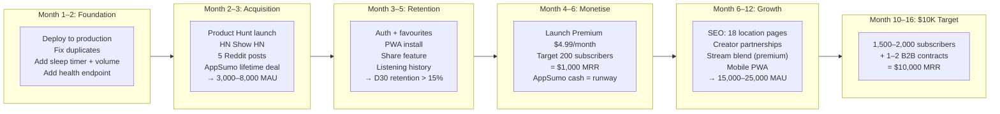

# Real Audio — MRR Paths

> Role: SaaS Founder + VC Analyst
> Questions: What gets to $10K MRR? What gets to $100K MRR? What kills it?

---

## The $10,000 MRR Question

**"What is the most likely path to $10,000 MRR?"**

### Definition
$10,000 MRR = approximately 2,000 paying subscribers at $4.99/month, or a blended combination of subscriptions and B2B contracts.

### Timeline: 10–16 months from today (if everything goes right)

### The Path

### Revenue mix at $10K MRR (most realistic)

| Source | Subscribers/contracts | MRR | % of total |
|--------|----------------------|-----|-----------|
| Premium subscriptions | 1,600 × $4.99 | $7,984 | 80% |
| Annual plan conversions | 200 × $3.25 equiv | $650 | 6.5% |
| B2B API contracts | 2 × $599/mo | $1,198 | 12% |
| Tip jar / donations | — | $168 | 1.5% |
| **Total** | | **$10,000** | 100% |

### Required MAU to hit $10K MRR

At 6% premium conversion rate (achievable with a good product and sleep/focus use case):
**~27,000 monthly active users required.**

At 4% conversion (more conservative, typical for web-only):
**~40,000 monthly active users required.**

### What accelerates the path

1. **Mobile app** (Expo) — multiplies TAM by 5×, App Store discovery is free acquisition
2. **Creator endorsement** — one productivity YouTuber with 100K+ subscribers mentioning Real Audio = 500–2,000 new users in a week
3. **Stream blend feature** — this is the "wow" feature that earns press coverage
4. **SEO articles** — "What does Bergen sound like right now?" ranks for ambient audio searches within 3–6 months

### What blocks the path

1. Not fixing the duplicate stream issue → user trust damage → poor retention
2. Not having a PWA → mobile users bounce → missing 60% of potential daily users
3. Locus Sonus server instability → silent stream errors → users don't return
4. Not having auth → cannot build favourites, history, or personalisation → no switching cost → poor retention

### Probability of reaching $10K MRR: 40–55%

Not because the product is bad — because the execution required is substantial for a solo founder: auth, Stripe, mobile, content partnerships, and consistent marketing over 12+ months. Most indie apps stall at $500–2,000 MRR due to acquisition plateau, not product failure.

---

## The $100,000 MRR Question

**"What is the most likely path to $100,000 MRR?"**

### Definition
$100,000 MRR = ~$1.2M ARR. This is a real business. This requires scale.

### The hard truth
$100K MRR is **not achievable as a web-only product** with the current architecture. Let's be precise about what it requires:

At 6% conversion: **~330,000 monthly active users**
At 4% conversion: **~500,000 monthly active users**

To get 330K+ MAU, you need:
1. **Native mobile apps** (iOS + Android) — this is non-negotiable. 60–70% of all media consumption is mobile. Without App Store presence, you have no organic discovery in the largest distribution channel.
2. **A content library** that is meaningfully large (50–100+ locations) — 18 is too few to sustain a $100K/month subscription business
3. **Real retention** — D30 >20%, which requires the listening identity features (acoustic passport, streaks)
4. **Marketing spend** — at this scale, organic alone is insufficient. Expect $5K–15K/month in paid acquisition at a CAC of $15–$30

### Two paths to $100K MRR

#### Path A: Consumer subscription at scale (24–36 months)

| Phase | Months | MAU | Paying | MRR |
|-------|--------|-----|--------|-----|
| Indie launch | 0–6 | 0 → 15K | 0 → 750 | $0 → $3,750 |
| Mobile app launch | 6–12 | 15K → 60K | 750 → 3,600 | $3,750 → $18,000 |
| Content expansion | 12–18 | 60K → 150K | 3,600 → 9,000 | $18,000 → $45,000 |
| Paid acquisition begins | 18–24 | 150K → 300K | 9,000 → 18,000 | $45,000 → $90,000 |
| Series A or profitability | 24–30 | 300K → 400K | 18,000 → 24,000 | $90,000 → $120,000 |

**Requirements for Path A:**
- $200K–500K in funding (or AppSumo cash + strong revenue reinvestment)
- Expo mobile app: 6–10 weeks of development
- Content expansion: 50+ exclusive stream partnerships
- 1–2 additional engineers for mobile + backend

**Probability:** 15–20% (conditional on funding and mobile execution)

#### Path B: B2B-led growth with consumer subscriptions as supplement (18–30 months)

This path is underappreciated but potentially faster to $100K MRR.

**The B2B thesis:** Wellness apps, meditation studios, spa hotel chains, co-working spaces, and corporate HR platforms all want "ambient audio" as a feature. They do not want to build it. Real Audio can white-label or API-license its streams.

**B2B customer profile:**
- Wellness SaaS (e.g., Headway, Intellect, Spill)
- Hotel chains (Marriott, Ace Hotels, boutique chains) — "listen to the world from your room"
- Co-working spaces (IWG, Industrious, WeWork) — ambient audio for focus zones
- Corporate HR platforms (employee wellness programs)
- Sleep technology companies (Oura, Withings) — ambient content layer

**Unit economics:**
- Average B2B contract: $499/month (API access + support)
- Enterprise contract: $2,000–5,000/month
- At $100K MRR via B2B: 200 SMB clients or 20–50 enterprise clients

**Why B2B is faster:** You need 200 business clients, not 330,000 individual users. The sales cycle is longer (weeks vs. seconds) but the contract size is 100× larger.

**B2B + consumer blended path:**

| Month | B2B MRR | Consumer MRR | Total |
|-------|---------|-------------|-------|
| 6 | $1,500 (3 clients) | $3,000 (600 subs) | $4,500 |
| 12 | $8,000 (16 clients) | $9,000 (1,800 subs) | $17,000 |
| 18 | $25,000 (50 clients) | $20,000 (4,000 subs) | $45,000 |
| 24 | $50,000 (100 clients) | $35,000 (7,000 subs) | $85,000 |
| 28 | $65,000 (130 clients) | $42,000 (8,400 subs) | $107,000 |

**Probability of Path B:** 25–35% (higher than Path A because it doesn't require mobile first)

### $100K MRR probability summary

| Path | Probability | Key constraint |
|------|------------|---------------|
| Consumer only (web) | 5% | TAM too small without mobile |
| Consumer with mobile app | 15–20% | Requires capital + execution |
| B2B led | 25–35% | Requires sales motion |
| Blended B2B + consumer | 30–40% | Best risk-adjusted path |

---

## What Would Kill the Company

### 1. The Locus Sonus Cease and Desist [Kill probability: 15–25%]

The Locus Sonus collective could:
- Ask Real Audio to stop monetising their streams (likely without malice — they just didn't expect this)
- Go offline due to funding issues at the École Supérieure d'Art
- Have a hardware failure that takes weeks to recover

**Mitigation:** Contact them now. Offer attribution + revenue share. Formalise the relationship.

**If not mitigated:** Every paying subscriber immediately loses what they paid for. Every positive review turns into a refund request.

---

### 2. Apple adds "Live Ambient" to iOS Focus Mode [Kill probability: 5–10% in year 1, rising to 30% by year 3]

Apple already has:
- A library of ambient sounds built into iPhone
- CarPlay integration
- The Media Session API that Real Audio uses
- Relationships with every content provider on earth

If Apple decides live ambient audio is a feature worth having (and it is), they can acquire a microphone network, license Locus Sonus, and ship it in a single iOS update. No App Store, no Stripe, no SEO helps when the OS itself becomes the competitor.

**Mitigation:** Build switching costs (listening history, acoustic passport) and proprietary content before this happens. The window is 18–24 months.

---

### 3. Viral moment without infrastructure [Kill probability: 30% of viral moments → crisis]

This is a positive event that becomes a negative outcome. If Real Audio gets featured on a major podcast, blog, or social thread and 5,000 people try the app simultaneously, every FFmpeg process on a single Render server dies, the site becomes unresponsive, and the moment passes.

A failed viral moment is worse than no viral moment — users leave and never return, and the press coverage has nowhere to point.

**Mitigation:** Implement stream multiplexing before any serious marketing. This is the #1 technical prerequisite.

---

### 4. Founder context switch [Kill probability: 35–50% over 2 years]

The single biggest killer of indie projects is not competition, not technical failure, not legal risk. It is the founder's life changing: a full-time job opportunity, a personal relationship, burnout, a new project that is shinier.

Real Audio is currently a 760-line side project. Turning it into a $100K MRR business requires 2+ years of consistent, focused work after the "exciting MVP" phase ends.

**There is no mitigation for this.** It is a personal commitment question.

---

### 5. Getting the product/pricing wrong [Kill probability: 20%]

Specific failure modes:
- Gating core streaming behind a paywall → users don't convert, word-of-mouth dies
- Pricing too high ($9.99+) → conversion rate collapses
- Building features users don't want (AI recommendation before retention is solved) → building the wrong thing for 6 months
- Not measuring retention → shipping features without knowing if they work

---

## What Should NOT Be Built

These are features that will consume engineering time without contributing to growth, retention, or revenue. They look valuable but aren't.

### ❌ Custom equaliser / audio processing
Users do not want to EQ a live stream. The point is unmediated realness. Adding an EQ destroys the product's identity.

### ❌ Social feed / community forum
A social layer before you have 10,000 active users creates a ghost town. Empty forums are worse than no forums. Build social features after the user base can sustain them.

### ❌ Podcast integration
No. This dilutes the product identity completely. Real Audio is "live ambient." Adding podcast playback creates a feature-bloated app that does nothing well.

### ❌ Sleep sounds library (non-live recordings)
The entire value proposition is live. Adding pre-recorded loops directly undermines the "this is real and happening right now" promise. If users want Calm's rain sounds, they already have Calm.

### ❌ A desktop app (Electron)
Nobody wants another Electron app. The web app works on desktop. PWA handles offline. Electron is 6 weeks of engineering for zero new users.

### ❌ Multi-room / Chromecast / AirPlay integration
Niche use case. 2–3 weeks of engineering. 0.1% of users. Build this in year 3 if requested repeatedly.

### ❌ Volume normalisation / loudness matching
The streams are intentionally raw. A glacier sounds quiet. A city sounds loud. That is the product. Normalising kills the dynamic range that makes each location feel distinct.

### ❌ A dashboard / admin panel (before you have an ops problem)
Until you have 50+ exclusive stream partners and a B2B API, a custom admin panel is waste. Use a spreadsheet, then a simple DB admin, then Retool if needed.

### ❌ Gamification beyond the minimum
Badges, achievements, points. These are engagement mechanics that work for language learning apps and fitness trackers. They feel jarring in a product about calm presence. One exception: the acoustic world map, which feels like achievement without feeling like a game.

---

## The Brutally Honest Founder Assessment

**You built something real.** A working streaming product with thoughtful UI, clean architecture, car display integration, and a genuinely unique product concept — in roughly two files and 760 lines of code. That is not nothing. Most "ambient audio apps" are just looping YouTube videos. Yours isn't.

**But here is what a YC Partner would tell you:**

> You have a remarkable demo and a fragile foundation. Everything the user sees works. Everything the business needs to survive doesn't exist yet — no database, no auth, no rate limiting, no monitoring, no legal clarity on your content source, no tests, no CI, no mobile app. You are 6–8 weeks of focused work away from a real product and 12–18 months away from a real business. The critical question is not "can this become a business" — it clearly can. The question is "will you do the unsexy work?" The path to $10K MRR requires building auth, Stripe, a mobile app, content partnerships, and 12 months of consistent marketing after the initial product hunt buzz fades. Most founders don't do this. The ones who do, usually succeed.

**Three things you must do before anything else:**

1. **Email Locus Sonus this week.** The entire product depends on their answer. Don't build a business on a foundation you haven't confirmed is permitted.

2. **Implement stream multiplexing.** Every marketing action you take risks a server crash. Fix the architecture before telling anyone about the product.

3. **Decide: lifestyle business or real company.** Both are valid. They require completely different decisions about where to spend your time and whether to raise money. The worst outcome is being ambiguous about this for 18 months.

The product deserves better than ambiguity. Make the call.
