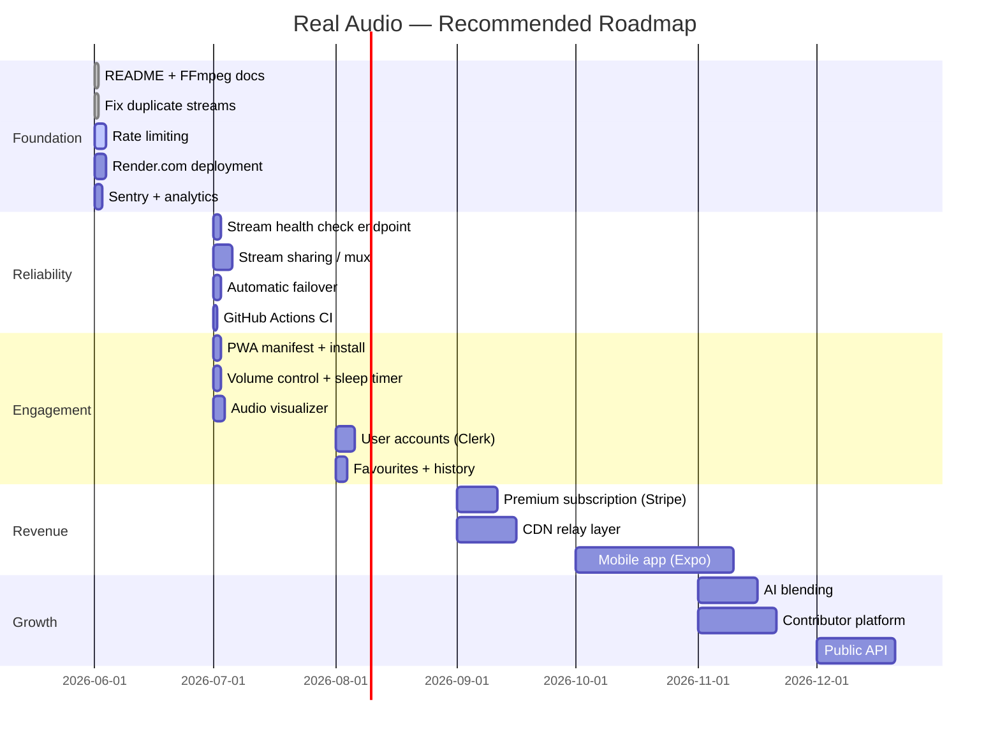

# Real Audio — Development Roadmap

---

## 15. Improvement Opportunities & Roadmap

### Quick Wins (1–2 days each)

| # | Task | Impact | Complexity | Effort |
|---|------|--------|-----------|--------|
| QW-01 | **Add `README.md`** with setup instructions, FFmpeg requirement, npm scripts, and GitHub link | High (onboarding) | Low | 2h |
| QW-02 | **Fix duplicate stream URLs** — give `lisbon` and `bangkok` distinct Locus Sonus sources | High (product integrity) | Low | 1h |
| QW-03 | **Add basic rate limiting** — use Next.js middleware or a simple in-memory counter to cap concurrent FFmpeg processes per IP | Critical (security) | Medium | 4h |
| QW-04 | **Add `GET /api/stream/health`** — probe all 18 upstream URLs with `ffprobe -v quiet` and return JSON status | High (ops visibility) | Medium | 3h |
| QW-05 | **Replace `fluent-ffmpeg`** with direct `child_process.spawn` or the maintained `@ffmpeg-installer` pattern | High (security) | Medium | 4h |
| QW-06 | **Add PWA manifest** — `public/manifest.json`, `<link rel="manifest">` in layout, icon set | Medium (mobile UX) | Low | 2h |
| QW-07 | **Add volume slider** — a simple `<input type="range">` wired to `audio.volume` | Medium (UX) | Low | 1h |
| QW-08 | **Add Plausible or Posthog analytics** (privacy-preserving) | High (product insight) | Low | 2h |
| QW-09 | **Document FFmpeg host dependency** in README + add startup check that logs a clear error if binary is missing | Critical (ops) | Low | 1h |
| QW-10 | **Add `<meta>` OG tags** to `layout.tsx` for social sharing | Low | Low | 30m |

---

### Short Term (1–2 weeks)

| # | Task | Impact | Complexity | Effort |
|---|------|--------|-----------|--------|
| ST-01 | **Stream sharing / multiplexing** — when N clients request the same stream ID, serve all from one FFmpeg process via a broadcast PassThrough | Critical (scalability) | High | 3–5d |
| ST-02 | **Sentry integration** — error tracking, performance monitoring, FFmpeg crash alerts | High (ops) | Low | 4h |
| ST-03 | **Stream health dashboard** — cron job (Render Cron / Vercel Cron) that probes all streams every 5 minutes and persists status | High (reliability) | Medium | 2d |
| ST-04 | **Automatic failover** — if primary stream fails mid-playback, auto-skip to next location | High (UX) | Medium | 1d |
| ST-05 | **Split `page.tsx` into components** — `LocationRow`, `PlayButton`, `StatusBar`, `VisualizerRings`, `LocationList` | Medium (maintainability) | Low | 1d |
| ST-06 | **Vitest unit tests** — test `formatLocalTime()`, `destroyAudio()`, stream switching state machine, Media Session handlers | Medium (quality) | Medium | 2d |
| ST-07 | **GitHub Actions CI** — lint + type-check on every PR | Medium (quality) | Low | 2h |
| ST-08 | **Render.com deployment** — with `ffmpeg` buildpack/Docker layer, env vars, auto-deploy on push | High (product) | Medium | 1d |
| ST-09 | **Add `<audio>` visualizer** — Web Audio API `AnalyserNode` feeding a canvas bar chart | Medium (delight) | Medium | 2d |
| ST-10 | **Search / filter** — simple text filter over the 18 locations client-side | Low | Low | 4h |

---

### Medium Term (1–2 months)

| # | Task | Impact | Complexity | Effort |
|---|------|--------|-----------|--------|
| MT-01 | **User accounts** (Clerk or Supabase Auth) — email/password + Google OAuth | High (retention) | Medium | 1w |
| MT-02 | **Favourites** — save preferred locations, persist to DB | High (retention) | Medium | 3d |
| MT-03 | **Listening history** — per-session log: location, start time, duration | Medium (insight) | Low | 2d |
| MT-04 | **Database** (Neon Postgres + Drizzle ORM) — users, favourites, sessions | High (product) | Medium | 3d |
| MT-05 | **CMS for locations** — move `LOCATIONS` and `STREAMS` arrays to database with admin panel | High (ops) | Medium | 1w |
| MT-06 | **Stream uptime monitoring UI** — show per-location live/offline badge | High (UX) | Medium | 3d |
| MT-07 | **Mobile PWA** — full-screen native-like experience, offline splash, home screen install | High (mobile UX) | Medium | 1w |
| MT-08 | **Curated playlists / "moods"** — e.g. "Deep focus", "Sleep", "City energy" — preset ordered queues | High (engagement) | Low | 3d |
| MT-09 | **Sleep timer** — auto-stop stream after N minutes | Medium (UX) | Low | 4h |
| MT-10 | **Share feature** — share a link to a specific location with a timestamp | Medium (growth) | Low | 1d |

---

### Long Term (3–6 months)

| # | Task | Impact | Complexity | Effort |
|---|------|--------|-----------|--------|
| LT-01 | **Premium subscription** (Stripe) — free tier: 5 locations; premium: all locations + AI features + no ads | High (revenue) | High | 2w |
| LT-02 | **CDN relay layer** — instead of per-client FFmpeg, push popular streams to Icecast relay servers or HLS CDN (Cloudflare Stream, Mux) | Critical (scalability) | High | 3w |
| LT-03 | **Mobile apps** (React Native / Expo) — iOS + Android with background audio, widgets, Siri/Google integration | High (market reach) | High | 6–8w |
| LT-04 | **AI soundscape blending** — mix two streams (e.g. 70% forest + 30% rain) using Web Audio API or server-side FFmpeg `-filter_complex amix` | High (differentiation) | High | 3w |
| LT-05 | **AI mood detection** — detect user's focus/relaxation state from optional device sensors; auto-select optimal stream | High (AI moat) | Very High | 4–6w |
| LT-06 | **Contributor platform** — allow community members to submit their own open-mic streams | High (content supply) | High | 4w |
| LT-07 | **Embeddable widget** — `<iframe>` player for blogs, Notion, productivity tools | Medium (distribution) | Medium | 1w |
| LT-08 | **API platform** — public API for developers to access Real Audio streams in their apps | Medium (B2B revenue) | High | 4w |
| LT-09 | **Localization** — translate UI to 10 languages | Low | Low | 1w |
| LT-10 | **Accessibility audit** — WCAG AA compliance, screen reader full support | Medium | Medium | 1w |

---

## 18. Development Roadmap (priority-ordered)

---

## 16. AI Product Opportunities

| Opportunity | Description | Revenue model | Complexity |
|-------------|-------------|--------------|-----------|
| **Smart location recommendation** | ML model trained on time-of-day, weather, user history → auto-suggest the right stream | Premium feature | Medium |
| **Mood-adaptive streaming** | Detect user state (focus/relaxed/tired) via optional questionnaire or device sensors → switch streams to match | Premium tier | High |
| **AI soundscape blending** | FFmpeg `amix` filter + simple UI slider to crossfade between two live streams in real time | Premium feature | Medium |
| **Sleep mode** | Gradually reduces audio bitrate and introduces natural silence periods; fades out over 30–60 min | Premium feature | Low |
| **"Sound journal"** | AI-generated weekly summary of where you "traveled" acoustically + what you were probably feeling | Premium/free engagement | Medium |
| **Location descriptions** | GPT-generated paragraph descriptions of each source location, its ecology, culture, and time context | Free (content quality) | Low |
| **Stream quality scoring** | Real-time ML model scores stream richness (is it wind + birds + water, or just static?) and surfaces quality badge | Premium (discovery) | High |
| **Custom AI soundscape** | If all live streams are offline or not matching mood, generate an AI ambient mix as fallback | Premium fallback | Very High |
| **Voice commands** | "Play something calm" / "Switch to nature" / "Where is the most interesting place right now?" | Premium | High |
| **Sleep correlation** | Opt-in sleep quality correlation: did users who listened to nature streams sleep better? | B2B research / premium insight | Very High |
