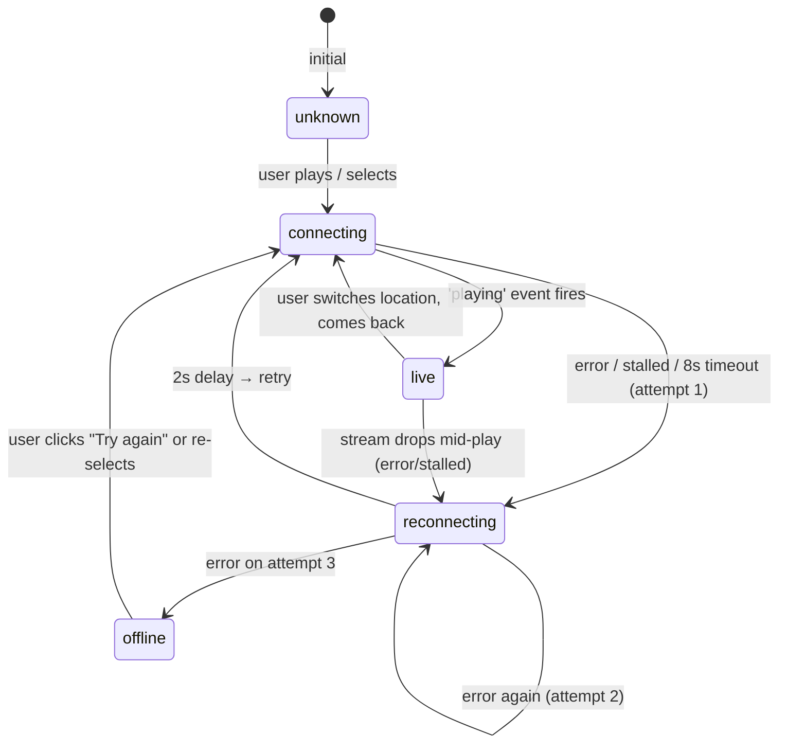

# Real Audio — Stream Health System

> Implemented: 2026-06-08
> File: `app/page.tsx`

---

## Overview

Every stream connection goes through a typed health lifecycle. The health state is tracked per location ID and persists within the browser session (resets on page reload). The system automatically retries failed connections up to 3 times before marking a stream as offline.

---

## Health States

| State | Meaning | UI: dot | UI: badge text | UI: main status |
|-------|---------|---------|---------------|----------------|
| `unknown` | Never attempted | Grey (default) | None | — |
| `connecting` | First connection attempt in progress | Grey (selected) | "Connecting" (active row only) | "Connecting…" |
| `live` | Audio data confirmed flowing | Glowing category colour | None (dot is enough) | "Streaming live" |
| `reconnecting` | Failed ≥1 time, retry scheduled | Amber pulsing | "Reconnecting" (active row only) | "Reconnecting…" |
| `offline` | Exhausted 3 attempts, no audio | Dark red | "Offline" (all rows) | Friendly error message |

---

## State Machine



---

## Retry Logic

```
MAX_RETRIES  = 3   (attempts before marking offline)
RETRY_DELAY  = 2s  (wait between retry attempts)
LOAD_TIMEOUT = 8s  (max wait for first audio frame)
```

### Failure triggers (any of these starts the retry sequence)

| Trigger | Source |
|---------|--------|
| HTMLAudioElement `error` event | Browser detects stream error |
| HTMLAudioElement `stalled` event | Browser received no data for a period |
| 8-second load watchdog timeout | No `playing` event in 8s after `play()` |
| `audio.play()` Promise rejection | Browser policy / network error before data |

### Retry sequence example

```
t=0s   User clicks Knepp Wildland
       health: 'connecting'  playState: 'loading'

t=2s   Browser fires 'stalled'
       attempt 1 of 3 — retryCount=1
       health: 'reconnecting'  playState: 'loading' (spinner stays)

t=4s   Auto-retry fires (2s later)
       health: 'connecting'  playState: 'loading'

t=6s   8-second watchdog fires (no data)
       attempt 2 of 3 — retryCount=2
       health: 'reconnecting'

t=8s   Auto-retry fires
       health: 'connecting'

t=10s  'error' event from browser
       attempt 3 of 3 — retryCount=3 → exhausted
       health: 'offline'  playState: 'error'
       UI: "This live microphone is temporarily offline. Try another location."
       "Try again" button appears
```

---

## Key Implementation Details

### `startStream(locationId)` — core function

```typescript
// Excerpt from app/page.tsx
const startStream = useCallback((locationId: string) => {
  clearTimeout(retryTimerRef.current)   // cancel pending retry
  clearTimeout(loadTimerRef.current)    // cancel load watchdog

  // Reset retries when switching locations (not retrying same)
  if (locationId !== lastAttemptedRef.current) retryCountRef.current = 0
  lastAttemptedRef.current = locationId

  // Set health badge immediately
  const isRetry = retryCountRef.current > 0
  setStreamHealth(prev => ({
    ...prev,
    [locationId]: isRetry ? 'reconnecting' : 'connecting',
  }))

  // 8-second no-data watchdog
  loadTimerRef.current = setTimeout(() => {
    if (audioRef.current !== audio) return
    onFailure()
  }, 8_000)

  // ...on success:
  const onPlaying = () => {
    clearTimeout(loadTimerRef.current)
    retryCountRef.current = 0
    setStreamHealth(prev => ({ ...prev, [locationId]: 'live' }))
    setPlayState('playing')
    setVisualizerActive(true)
  }

  // ...on any failure:
  function onFailure() {
    const attempt = retryCountRef.current + 1
    retryCountRef.current = attempt
    if (attempt < MAX_RETRIES) {
      setStreamHealth(prev => ({ ...prev, [locationId]: 'reconnecting' }))
      retryTimerRef.current = setTimeout(() => {
        startStreamRef.current?.(locationId)  // ref-based to avoid stale closure
      }, RETRY_DELAY)
    } else {
      retryCountRef.current = 0
      setStreamHealth(prev => ({ ...prev, [locationId]: 'offline' }))
      setPlayState('error')
      setErrorMessage('This live microphone is temporarily offline. Try another location.')
    }
  }
}, [])
```

### Stale-closure safety

Retry closures call `startStreamRef.current?.(locationId)` rather than `startStream` directly. This ensures the retry always calls the **latest version** of `startStream` even though it was scheduled in a closure from a previous render cycle.

```typescript
// startStreamRef is kept current on every render
useEffect(() => {
  startStreamRef.current = startStream
}, [startStream])
```

### User-initiated retry resets the counter

When the user explicitly clicks "Try again" or selects a location:
```typescript
const handleRetryManual = () => {
  lastAttemptedRef.current = ''  // force retryCount reset in startStream
  retryCountRef.current    = 0
  startStream(activeId)
}
```

### Location switch cancels pending retries

When the user switches to a different location while a retry is pending:
```typescript
const startStream = useCallback((locationId: string) => {
  clearTimeout(retryTimerRef.current)  // ← cancels any retry timer immediately
  clearTimeout(loadTimerRef.current)   // ← cancels the watchdog timer
  // ...
```

---

## UI: Badge Placement

Health badges appear inline, **below the description line** within each location row. This avoids redesigning the layout and stays within the 280px max-width column.

```
┌─────────────────────────────────────────────────┐
│ ● Knepp Wildland              England  06:42     │
│   Chalk stream & birdsong                        │
├─────────────────────────────────────────────────┤
│ ● Langenholte (active, reconnecting)             │
│   IJssel wetland & reeds      Amst.   07:42      │
│   Reconnecting                                   │  ← amber badge
├─────────────────────────────────────────────────┤
│ ○ Ortler Glacier                                 │
│   Wind, ice & silence         Alps    07:42      │
│   Offline                                        │  ← dark red badge (if tried)
└─────────────────────────────────────────────────┘
```

**Badge visibility rules:**
- `connecting` — shown only on the **active** row (selected + loading)
- `reconnecting` — shown only on the **active** row (selected + retrying)
- `offline` — shown on **any** row that was attempted and exhausted retries this session
- `live` — **not shown as text**; the glowing dot communicates this without extra text
- `unknown` — no badge (never attempted)

---

## Dot Colour States

| Condition | Dot appearance |
|-----------|---------------|
| Streaming this location | Glowing category colour (emerald / amber) |
| Selected + reconnecting | Amber, `animate-pulse` |
| Selected + offline | Dark red, static |
| Selected + idle/connecting | Medium grey |
| Not selected + offline | Faint red |
| Not selected + default | Dark grey, hover lightens |

---

## Error Message Design

When `offline` is reached, the error message shown in the main status area is:

> **"This live microphone is temporarily offline. Try another location."**

Design rationale:
- Uses "live microphone" (not "stream" or "error") — aligns with the product's identity
- "temporarily" — honest but not alarming, sets expectation that it may come back
- "Try another location." — actionable, points to the solution without technical jargon
- Replaces the generic "Stream error" message from the previous implementation

The "Try again" button (renamed from "Retry") resets the retry counter and fires a fresh connection attempt.

---

## Known Limitations

| Limitation | Notes |
|-----------|-------|
| Health state does not persist across page reloads | By design — streams can recover between sessions |
| The 8-second watchdog does not restart if `onWaiting` fires during playback | `onWaiting` during live playback is normal buffering, not a failure |
| `reconnecting` status shown during the 2-second wait before retry | The spinner stays active; the user sees "Reconnecting…" in the status bar |
| Offline badge persists until the user manually retries or switches away | Does not auto-clear if the stream recovers while the user is on a different location |
